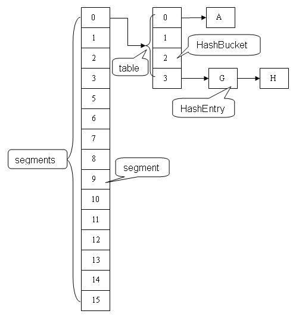
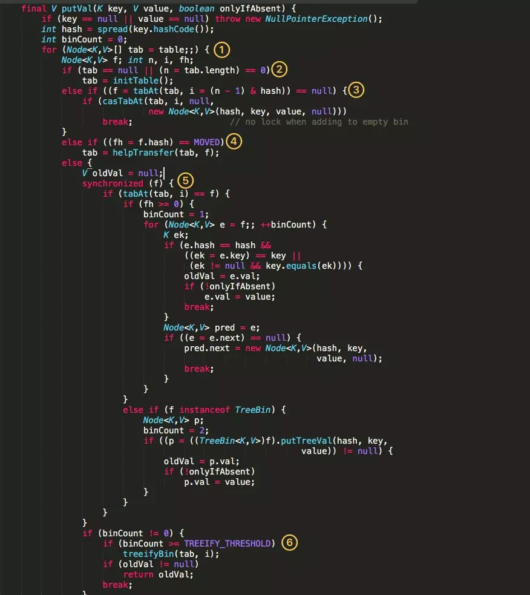

# ConcurrentHashMap

> 时间：2020/4/13

## HashMap的问题

在多线程下，`jdk7`中的`HashMap`会导致回型链表，导致`get`的时候死循环，在`jdk8`中虽然解决了这个回型链表的问题，但是还是会导致数据错误的问题，所以不能在多线程下使用`HashMap`。

`HashTable`虽然线程安全但是效率低下。

## ConcurrentHashMap

容器里面有多把锁，每一把锁用于锁容器其中一部分数据，那么当多线程访问容器里面不同数据段的数据时，线程间就不会存在锁竞争，从而可以有效的提高并发访问效率。

`ConcurrentHashMap`是由`Segment`数组结构和`HashEntry`数组结构组成。`Segment`是一种可重入锁`ReentrantLock`，在`ConcurrentHashMap`里扮演锁的角色，`HashEntry`则用于存储键值对数据。一个`ConcurrentHashMap`里包含了一个`Segment`数组，`Segment`的结构和`HashMap`类似，是一种数组和链表结构，一个`Segment`里包含了一个`HashEntry`数组，每个`HashEntry`是一个链表结构的元素，每个`Segment`守护着一个`HashEntry`数组里的元素，当对`HashEntry`数组进行修改时，必须首先获得它对应的`Segment`锁。



`Java8`的实现已经抛弃了`Segment`分段锁机制，利用`CAS+Synchronized来`保证并发更新的安全，数组结构采用：数组+链表+红黑树。


## put函数



- 根据`key` 计算出 `hashcode` 。
- 判断是否需要进行初始化。
- `f` 即为当前 key 定位出的 `Node`，如果为空表示当前位置可以写入数据，利用 `CAS` 尝试写入，失败则自旋保证成功。
- 如果当前位置的 `hashcode == MOVED == -1`,则需要进行扩容。
- 如果都不满足，则利用 `synchronized` 锁写入数据。
- 如果数量大于 `TREEIFY_THRESHOLD` 则要转换为红黑树。

## 如何保证 table 只初始化一次

```java
final V putVal(K key, V value, boolean onlyIfAbsent) {
    if (key == null || value == null) throw new NullPointerException();
    int hash = spread(key.hashCode());
    int binCount = 0;
    for (Node<K,V>[] tab = table;;) {
        Node<K,V> f; int n, i, fh; K fk; V fv;
        if (tab == null || (n = tab.length) == 0)//判断table还未初始化
            tab = initTable();//初始化table
        else if ((f = tabAt(tab, i = (n - 1) & hash)) == null) {
            if (casTabAt(tab, i, null, new Node<K,V>(hash, key, value)))
                break;                   // no lock when adding to empty bin
        }
        //...省略一部分源码
    }
} 

private final Node<K,V>[] initTable() {
    Node<K,V>[] tab; int sc;
    while ((tab = table) == null || tab.length == 0) {
        //如果一个线程发现sizeCtl<0，意味着另外的线程执行CAS操作成功，当前线程只需要让出cpu时间片，
        //由于sizeCtl是volatile的，保证了顺序性和可见性
        if ((sc = sizeCtl) < 0)//sc保存了sizeCtl的值
            Thread.yield(); // lost initialization race; just spin
        else if (U.compareAndSetInt(this, SIZECTL, sc, -1)) {//cas操作判断并置为-1
            try {
                if ((tab = table) == null || tab.length == 0) {
                    int n = (sc > 0) ? sc : DEFAULT_CAPACITY;//DEFAULT_CAPACITY = 16，若没有参数则大小默认为16
                    @SuppressWarnings("unchecked")
                    Node<K,V>[] nt = (Node<K,V>[])new Node<?,?>[n];
                    table = tab = nt;
                    sc = n - (n >>> 2);
                }
            } finally {
                sizeCtl = sc;
            }
            break;
        }
    }
    return tab;
}  
```

