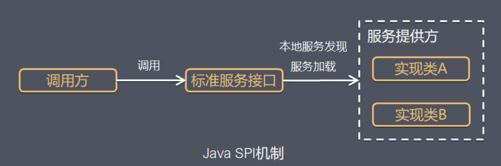
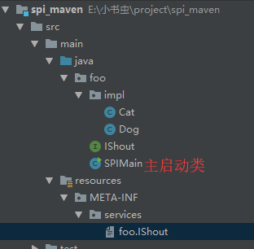
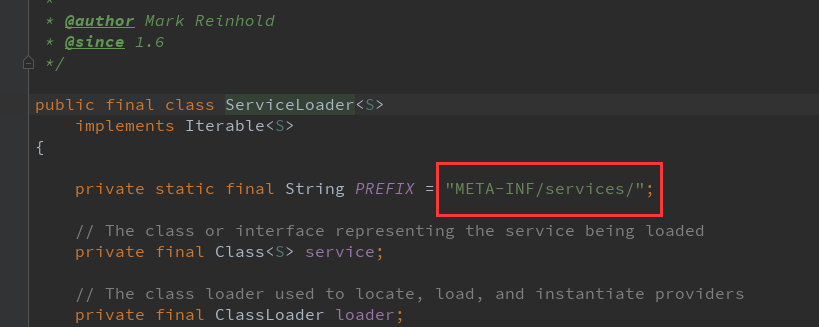

# SPI

> 时间：2020/5/2


全称 `Service Provider Interface`，是 `jdk` 内置的一种服务提供发现机制，可以用来启用框架扩展和替换组件，主要是被框架的开发人员使用，比如 `java.sql.Driver` 接口，其他不同厂商可以针对同一接口做出不同的实现，`MySQL` 和 `PostgreSQL` 都有不同的实现提供给用户，而 `Java` 的 `SPI` 机制可以为某个接口寻找服务实现。`Java` 中 `SPI` 机制主要思想是将装配的控制权移到程序之外，在模块化设计中这个机制尤其重要，其核心思想就是 **解耦**。

SPI 与 API 区别：

- API 是调用并用于实现目标的类、接口、方法等的描述；
- SPI 是扩展和实现以实现目标的类、接口、方法等的描述；

换句话说，API 为操作提供特定的类、方法，SPI 通过操作来符合特定的类、方法。

机制如下：



Java SPI 实际上是“**基于接口的编程＋策略模式＋配置文件**”组合实现的动态加载机制。

系统设计的各个抽象，往往有很多不同的实现方案，在面向对象的设计里，一般推荐模块之间基于接口编程，模块之间步对实现类进行硬编码。一旦代码里涉及具体的实现类，就违反了可拔插的原则，如果需要替换一种实现，就需要修改代码。为了实现在模块装配的时候能不在程序里动态指明，这就是需要一种服务发现机制。

Java SPI就是提供这样的一个机制：为某个接口寻找服务实现的机制。

## 场景

- 数据库驱动加载接口实现类的加载
   JDBC 加载不同类型数据库的驱动

- 日志门面接口实现类加载
   SLF4J 加载不同提供商的日志实现类

- Spring
   Spring 中大量使用了 SPI,比如：对 servlet3.0 规范对 ServletContainerInitializer 的实现、自动类型转换 Type Conversion SPI(Converter SPI、Formatter SPI) 等 
- Dubbo
   Dubbo 中也大量使用 SPI 的方式实现框架的扩展, 不过它对 Java 提供的原生 SPI 做了封装，允许用户扩展实现 Filter 接口

## 使用

1、当服务提供者提供了接口的一种具体实现后，在 jar 包的 META-INF/services 目录下创建一个以“接口全限定名”为命名的文件，内容为实现类的全限定名；

2、接口实现类所在的 jar 包放在主程序的 classpath 中；

3、主程序通过 java.util.ServiceLoder 动态装载实现模块，它通过扫描 META-INF/services 目录下的配置文件找到实现类的全限定名，把类加载到 JVM；

4、SPI 的实现类必须携带一个不带参数的构造方法。**（因为要通过反射获取到实例对象）**

新建一个 maven 项目，目录结构



默认 maven 的compile level 为5，在pom中改一下，添加

```xml
<build>
    <plugins>
        <plugin>
            <groupId>org.apache.maven.plugins</groupId>
            <artifactId>maven-compiler-plugin</artifactId>
            <version>3.1</version>
            <configuration>
                <source>1.8</source>
                <target>1.8</target>
            </configuration>
        </plugin>

    </plugins>
</build>
```


代码很简单，大概浏览一下：

```java
//IShout.java
package foo;

public interface IShout {
    void shout();
}

//Cat.java
package foo.impl;
import foo.IShout;
public class Cat implements IShout {

    public void shout() {
        System.out.println("miao miao");
    }
}
//Dog.java
package foo.impl;
import foo.IShout;

public class Dog implements IShout {

    public void shout() {
        System.out.println("wang wang");
    }
}
//主类
package foo;
import java.util.ServiceLoader;
public class SPIMain {
    public static void main(String[] args) {
        ServiceLoader<IShout> shouts = ServiceLoader.load(IShout.class);
        for (IShout s:shouts) {
            s.shout();
        }
    }
}
```

META-INF目录是自己新建的，为什么必须是这个文件夹，因为是源码里面写死的：



里面有一个以“接口全限定名”为命名的文件，内容为实现类的全限定名：

```
foo.impl.Cat
foo.impl.Dog
```

运行结果：

```
miao miao
wang wang
```

## 总结

**优点**：
 使用Java SPI机制的优势是实现解耦，使得第三方服务模块的装配控制的逻辑与调用者的业务代码分离，而不是耦合在一起。应用程序可以根据实际业务情况启用框架扩展或替换框架组件。

相比使用提供接口jar包，供第三方服务模块实现接口的方式，SPI的方式使得源框架，不必关心接口的实现类的路径，可以不用通过下面的方式获取接口实现类：

- 代码硬编码import 导入实现类
- 指定类全路径反射获取：例如在JDBC4.0之前，JDBC中获取数据库驱动类需要通过**Class.forName("com.mysql.jdbc.Driver")**，类似语句先动态加载数据库相关的驱动，然后再进行获取连接等的操作
- 第三方服务模块把接口实现类实例注册到指定地方，源框架从该处访问实例

通过SPI的方式，第三方服务模块实现接口后，在第三方的项目代码的META-INF/services目录下的配置文件指定实现类的全路径名，源码框架即可找到实现类

**缺点**：

- 虽然ServiceLoader也算是使用的延迟加载，但是基本只能通过遍历全部获取，也就是接口的实现类全部加载并实例化一遍。如果你并不想用某些实现类，它也被加载并实例化了，这就造成了浪费。获取某个实现类的方式不够灵活，只能通过Iterator形式获取，不能根据某个参数来获取对应的实现类。
- 多个并发多线程使用ServiceLoader类的实例是不安全的。

针对以上的不足点，我们在SPI机制选择时，可以考虑使用dubbo实现的SPI机制。

> 具体参考: 
>
> http://dubbo.apache.org/zh-cn/blog/introduction-to-dubbo-spi.html
>
> 其他参考文章: 
>
> http://www.spring4all.com/article/260
>
> https://blog.csdn.net/yangguosb/article/details/78772730
>
> https://www.jianshu.com/p/46b42f7f593c


