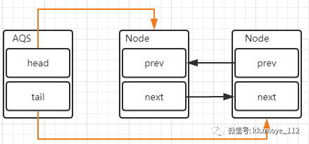
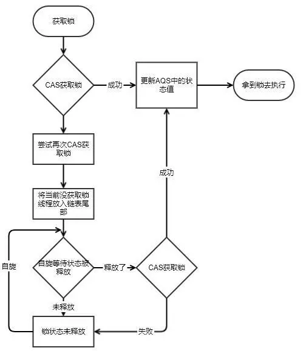

# AQS

> 时间 2020/5/9

首先还是看一下源码中的注释

```
Provides a framework for implementing blocking locks and related synchronizers (semaphores, events, etc) that rely on first-in-first-out (FIFO) wait queues.  This class is designed to be a useful basis for most kinds of synchronizers that rely on a single atomic {@code int state} value to represent state. Subclasses must define the protected methods that change this state, and which define what that state means in terms of this object being acquired or released.  Given these, the other methods in this class carry out all queuing and blocking mechanics. Subclasses can maintain other state fields, but only the atomically updated {@code int state} value manipulated using methods {@link #getState}, {@link #setState} and {@link #compareAndSetState} is tracked with respect to synchronization.

Subclasses should be defined as non-public internal helper classes that are used to implement the synchronization properties of their enclosing class.  Class {@code AbstractQueuedSynchronizer} does not implement any synchronization interface.  Instead it defines methods such as {@link #acquireInterruptibly} that can be invoked as appropriate by concrete locks and related synchronizers to implement their public methods.

This class supports either or both a default <em>exclusive</em> mode and a <em>shared</em> mode. When acquired in exclusive mode,attempted acquires by other threads cannot succeed. Shared mode acquires by multiple threads may (but need not) succeed. This class does not &quot;understand&quot; these differences except in the mechanical sense that when a shared mode acquire succeeds, the next waiting thread (if one exists) must also determine whether it can acquire as well. Threads waiting in the different modes share the same FIFO queue. Usually, implementation subclasses support only one of these modes, but both can come into play for example in a {@link ReadWriteLock}. Subclasses that support only exclusive or only shared modes need not define the methods supporting the unused mode.

This class defines a nested {@link ConditionObject} class that can be used as a {@link Condition} implementation by subclasses supporting exclusive mode for which method {@link  #isHeldExclusively} reports whether synchronization is exclusively held with respect to the current thread, method {@link #release} invoked with the current {@link #getState} value fully releases this object, and {@link #acquire }, given this saved state value,eventually restores this object to its previous acquired state.  No {@code AbstractQueuedSynchronizer} method otherwise creates such a condition, so if this constraint cannot be met, do not use it.  The behavior of {@link ConditionObject} depends of course on the semantics of its synchronizer implementation.

This class provides inspection, instrumentation, and monitoring methods for the internal queue, as well as similar methods for condition objects. These can be exported as desired into classes using an {@code AbstractQueuedSynchronizer} for their synchronization mechanics.
Serialization of this class stores only the underlying atomic integer maintaining state, so deserialized objects have empty thread queues. Typical subclasses requiring serializability will define a {@code readObject} method that restores this to a known initial state upon deserialization.
 
 Usage
 
To use this class as the basis of a synchronizer, redefine the following methods, as applicable, by inspecting and/or modifying the synchronization state using {@link #getState}, {@link #setState} and/or {@link #compareAndSetState}:
 
 
  {@link #tryAcquire}
  {@link #tryRelease}
  {@link #tryAcquireShared}
  {@link #tryReleaseShared}
  {@link #isHeldExclusively}
 
 
Each of these methods by default throws {@link UnsupportedOperationException}.  Implementations of these methods must be internally thread-safe, and should in general be short and not block. Defining these methods is the <em>only</em> supported means of using this class. All other methods are declared {@code final} because they cannot be independently varied.

You may also find the inherited methods from {@link AbstractOwnableSynchronizer} useful to keep track of the thread owning an exclusive synchronizer.  You are encouraged to use them -- this enables monitoring and diagnostic tools to assist users in determining which threads hold locks.

Even though this class is based on an internal FIFO queue, it does not automatically enforce FIFO acquisition policies.  The core of exclusive synchronization takes the form:

 
 * Acquire:
 *     while (!tryAcquire(arg)) {
 *        <em>enqueue thread if it is not already queued</em>;
 *        <em>possibly block current thread</em>;
 *     }
 *
 * Release:
 *     if (tryRelease(arg))
 *        <em>unblock the first queued thread</em>;


(Shared mode is similar but may involve cascading signals.)

Because checks in acquire are invoked before enqueuing, a newly acquiring thread may barge ahead of others that are blocked and queued.  However, you can, if desired,define {@code tryAcquire} and/or {@code tryAcquireShared} to disable barging by internally invoking one or more of the inspection methods, thereby providing a fair FIFO acquisition order.In particular, most fair synchronizers can define {@code tryAcquire} to return {@code false} if {@link #hasQueuedPredecessors} (a method specifically designed to be used by fair synchronizers) returns {@code true}.  Other variations are possible.

Throughput and scalability are generally highest for the default barging (also known as greedy,renouncement, and convoy-avoidance) strategy. While this is not guaranteed to be fair or starvation-free, earlier queued threads are allowed to recontend before later queued threads, and each recontention has an unbiased chance to succeed against incoming threads.  Also, while acquires do not &quot;spin&quot; in the usual sense, they may perform multiple invocations of {@code tryAcquire} interspersed with other computations before blocking.  This gives most of the benefits of spins when exclusive synchronization is only briefly held, without most of the liabilities when it isn't. If so desired, you can augment this by preceding calls to acquire methods with "fast-path" checks, possibly prechecking {@link #hasContended} and/or {@link #hasQueuedThreads} to only do so if the synchronizer is likely not to be contended.

This class provides an efficient and scalable basis for synchronization in part by specializing its range of use to synchronizers that can rely on {@code int} state, acquire, and release parameters, and an internal FIFO wait queue. When this does not suffice, you can build synchronizers from a lower level using {@link java.util.concurrent.atomic atomic} classes, your own custom {@link java.util.Queue} classes, and {@link LockSupport} blocking support.

```

中文（之后会对翻译不好的地方手动翻译一下）

```
提供一个框架，用于实现依赖于先进先出（FIFO）等待队列的阻塞锁和相关的同步器（信号灯，事件等）。此类旨在为大多数依赖单个原子{@code int state}值表示状态的同步器提供有用的基础。子类必须定义更改此状态的受保护方法，并定义该状态对于获取或释放此对象而言意味着什么。鉴于这些，此类中的其他方法将执行所有排队和阻塞机制。子类可以维护其他状态字段，但是仅跟踪关于同步的使用方法{@link #getState}，{@ link #setState}和{@link #compareAndSetState}操作的原子更新的{@code int state}值。

子类应该定义为用于实现其封闭类的同步属性的非公共内部帮助器类。类{@code AbstractQueuedSynchronizer}没有实现任何同步接口。相反，它定义了{@link #acquireInterruptible}之类的方法，可以通过具体的锁和相关的同步器适当地调用这些方法来实现其公共方法。

此类支持默认排他模式和共享模式之一或两者。当以独占模式进行获取时，其他线程尝试进行的获取将无法成功。由多个线程获取的共享模式可能（但不一定）成功。该类不理解这些差异，只是从机械意义上说，当成功获取共享模式时，下一个等待线程（如果存在）也必须确定它是否也可以获取。在不同模式下等待的线程共享相同的FIFO队列。通常，实现子类仅支持这些模式之一，但例如可以在{@link ReadWriteLock}中发挥作用。仅支持互斥模式或仅支持共享模式的子类无需定义支持未使用模式的方法。

此类定义了一个嵌套的{@link ConditionObject}类，该类可以被支持独占模式的子类用作{@link Condition}实现，为此方法{@link #isHeldExclusively}报告是否针对当前线程专有地保持同步，使用当前{@link #getState}值调用的方法{@link #release}会完全释放此对象，并且给定已保存的状态值，{@ link #acquire}最终会将此对象恢复为其先前获取的状态。否则，没有{@code AbstractQueuedSynchronizer}方法会创建这样的条件，因此，如果无法满足此约束，请不要使用它。 {@link ConditionObject}的行为当然取决于其同步器实现的语义。

此类提供了内部队列的检查，检测和监视方法，以及条件对象的类似方法。可以根据需要使用{@code AbstractQueuedSynchronizer}将它们导出到类中以实现其同步机制。
此类的序列化仅存储基础原子整数维护状态，因此反序列化的对象具有空线程队列。需要可序列化的典型子类将定义一个{@code readObject}方法，该方法可在反序列化时将其恢复为已知的初始状态。

 用法
 
要将此类用作同步器的基础，请使用{@link #getState}，{@ link #setState}和/或{@link #compareAndSetState检查和/或修改同步状态，重新定义以下方法（如适用） }：

  {@link #tryAcquire}
  {@link #tryRelease}
  {@link #tryAcquireShared}
  {@link #tryReleaseShared}
  {@link #isHeldExclusively}


默认情况下，这些方法中的每一个都会引发{@link UnsupportedOperationException}。这些方法的实现必须在内部是线程安全的，并且通常应简短且不阻塞。定义这些方法是<em> only </ em>支持的使用此类的方法。所有其他方法都声明为{@code final}，因为它们不能独立变化。

您可能还会发现从{@link AbstractOwnableSynchronizer}继承的方法对于跟踪拥有独占同步器的线程很有用。鼓励您使用它们-这将启用监视和诊断工具，以帮助用户确定哪些线程持有锁。

即使此类基于内部FIFO队列，它也不会自动执行FIFO获取策略。独占同步的核心采取以下形式：
 * Acquire:
 *     while (!tryAcquire(arg)) {
 *        <em>如果线程尚未进行排队，则对其进行排队</em>;
 *        <em>可能阻塞当前线程</em>;
 *     }
 *
 * Release:
 *     if (tryRelease(arg))
 *        <em>解除第一个排队线程的阻塞</em>;
 
 （共享模式相似，但可能涉及级联信号。）

因为获取队列中的获取检查是在排队之前被调用的，所以新获取线程可能会在其他被阻塞和排队的线程之前进行插入。但是，如果需要，您可以定义{@code tryAcquire}和/或{@code tryAcquireShared}以通过内部调用一种或多种检查方法来禁用插入，从而提供公平的FIFO获取顺序。尤其是大多数公平的同步器如果{@link #hasQueuedPredecessors}（一种专门设计用于公平同步器的方法）返回{@code true}，则可以定义{@code tryAcquire}以返回{@code false}。其他变化也是可能的。

对于默认插入（也称为贪婪，放弃和避免通信）策略，吞吐量和可伸缩性通常最高。尽管不能保证这是公平的，也不会出现饥饿现象，但是可以让较早排队的线程在较晚排队的线程之前进行重新竞争，并且每个重新争用都可以毫无偏向地成功抵御传入线程。同样，尽管获取不是通常意义上的旋转，但它们可能会在阻塞之前执行{@code tryAcquire}的多次调用，并插入其他计算。当仅短暂地保持排他同步时，这将提供旋转的大部分好处，而在不进行排他同步时，则不会带来很多负担。如果需要的话，您可以通过在调用之前对获取方法进行“快速路径”检查来增强此功能，可能会预先检查{@link #hasContended}和/或{@link #hasQueuedThreads}以仅在同步器可能不这样做的情况下这样做争辩。

这个类为同步提供了一个有效的和可扩展的基础，部分是通过将它的使用范围专门化为同步器，这些同步器可以依赖于{@code int}state、获取和释放参数，以及一个内部FIFO等待队列。当这还不够时，您可以使用{@link java.util.concurrent从较低的层次构建同步器。原子原子}类，您自己的自定义{@link java.util。队列}类和{@link LockSupport}阻塞支持。
```

总结一下：

全称：`AbstractQueuedSynchronizer` 抽象的队列式同步器（抽象类）。值得注意的是它使用的是**<u>模板方法模式的设计模式</u>**。搞清楚它的设计模式对理解它的源代码很有帮助。

> 自定义同步器在实现的时候只需要实现共享资源state的获取和释放方式即可，至于具体线程等待队列的维护，AQS已经在顶层实现好了。自定义同步器实现的时候主要实现下面几种方法：
> isHeldExclusively()：该线程是否正在独占资源。只有用到condition才需要去实现它。
> tryAcquire(int)：独占方式。尝试获取资源，成功则返回true，失败则返回false。
> tryRelease(int)：独占方式。尝试释放资源，成功则返回true，失败则返回false。
> tryAcquireShared(int)：共享方式。尝试获取资源。负数表示失败；0表示成功，但没有剩余可用资源；正数表示成功，且有剩余资源。
> tryReleaseShared(int)：共享方式。尝试释放资源，如果释放后允许唤醒后续等待结点返回true，否则返回false。

**`AQS` 的核心思想**是，如果被请求的共享资源空闲，则将当前请求资源的线程设置为有效的工作线程，并将共享资源设置为锁定状态，如果被请求的共享资源被占用，那么就需要一套线程阻塞等待以及被唤醒时锁分配的机制，这个机制 `AQS` 是用 `CLH` 队列锁实现的，即将暂时获取不到锁的线程加入到队列中。
`CLH（Craig，Landin，and Hagersten）`队列是一个虚拟的双向队列，虚拟的双向队列即不存在队列实例，仅存在节点之间的关联关系。
**`AQS` 是将每一条请求共享资源的线程封装成一个 `CLH` 锁队列的一个结点（`Node`），来实现锁的分配。**

用大白话来说，`AQS` 就是基于 `CLH` 队列，用 `volatile` 修饰共享变量 `state`，线程通过 `CAS`去改变状态符，成功则获取锁成功，失败则进入等待队列，等待被唤醒。

**自旋锁、互斥锁、读锁写锁、条件产量、信号量、栅栏都是 `AQS` 的衍生物**

从使用层面上来说有两种功能：独占和共享

- 独占锁，每次只能有一个线程持有锁， `ReentrantLock` 就是以独占方式实现的互斥锁。
- 共享锁，允许多个线程同时获取锁，并发访问共享资源，比如 `ReentrantReadWriteLock`、`Semaphore`、`CountDownLatch`、`ReadWriteLock`、`CyclicBarrier`。


## 模板模式

这边简单介绍下：

<u>在模板模式（Template Pattern）中，一个抽象类公开定义了执行它的方法的方式/模板。它的子类可以按需要重写方法实现，但调用将以抽象类中定义的方式进行。这种类型的设计模式属于行为型模式。</u>

**通过定义一个算法骨架，而将算法中的步骤延迟到子类，这样子类就可以复写这些步骤的实现来实现特定的算法。**

是类的一种行为，只需要准备一个抽象类，将逻辑用具体方法和构造函数的形式来表现，**后声明一些抽象方法来迫使子类必须实现其逻辑**，不同的子类可以实现不同的方法，从而可以让剩余的逻辑有不同的实现。即可以定义抽象的方法，让子类实现剩余的逻辑。

代码示例：

```java
public abstract class Game {
    protected abstract void initialize();

    protected abstract void startPlay();

    protected abstract void endPlay();

    //模板 算法骨架 子类也无法重写其算法逻辑 但是具体方法的逻辑可以交给子类重写
    public final void play() {
        initialize();
        startPlay();
        endPlay();
    }
}
```

子类 `Cricket`

```java
public class Cricket extends Game {
   @Override
   void endPlay() {
      System.out.println("Cricket Game Finished!");
   }
 
   @Override
   void initialize() {
      System.out.println("Cricket Game Initialized! Start playing.");
   }
 
   @Override
   void startPlay() {
      System.out.println("Cricket Game Started. Enjoy the game!");
   }
}
```

调用：

```java
Clicket  c = new Clicket();
c.play();
```

比如源码中的acquire方法（模板方法）：

```java
public final void acquire(int arg) {
    if (!tryAcquire(arg) &&
        acquireQueued(addWaiter(Node.EXCLUSIVE), arg))
        selfInterrupt();
}
```

首先，这个方法是 `final`，也就是说这个方法是不会被子类重写的，再看看tryAcquire()

```java
protected boolean tryAcquire(int arg) {
    throw new UnsupportedOperationException();
}
```

虽然这个方法不是 `abstract` 的，但是也能很清楚的知道，该方法需要被子类重写逻辑，方法里面的逻辑可以由各个子类来重写自己的逻辑，但方法的调用逻辑是由父类这边来操控的。

`acquire` 这个方法的主要逻辑是

- 通过 `tryAcquire` 尝试获取独占锁，如果成功返回 `true`，失败返回 `false`
- 如果 `tryAcquire` 失败，则会通过 `addWaiter` 方法将当前线程封装成 `Node` 添加到 `AQS` 队列尾部
- `acquireQueued`，将 `Node` 作为参数，通过自旋去尝试获取锁。

## 回到同步器

同步器的主要使用方式是继承，子类通过继承同步器并实现它的抽象方法来管理同步状态，在抽象方法的实现过程中需要修改同步状态，于是有 3 个方法: `getState()、setState(int newState)、compareAndSetState(int expect,int update)`。

> getState():获取当前同步状态
>
> setState(int newState):设置当前同步状态
>
> compareAndSetState(int expect,int update):使用 CAS 设置当前状态，该方法能保证状态设置的原子性

- 和锁之间的关系

  同步器是实现锁的关键，在锁的实现中聚合同步器，利用同步器实现锁的语义。

  **锁是面向使用者的**，它定义了使用者与锁交互的接口（比如可以允许两个线程并行访问）,隐藏了实现细节；**同步器面向的是锁的实现者**，他简化了锁的实现方式，屏蔽了同步状态管理、线程的排队、等待于唤醒等底层操作。缩合同步器很好地隔离了使用者和实现者所需关注的领域。

同步器中可重写的方法：

|                  方法名称                   |                             描述                             |
| :-----------------------------------------: | :----------------------------------------------------------: |
|    protected boolean trtAcquire(int arg)    | 独占式获取同步状态，实现该方法需要查询当前状态并判断同步状态是否符合预期，然后再进行 CAS 设置同步状态 |
|    protected boolean tryRelease(int arg)    | 独占式释放同步状态，等待获取同步状态的线程将有机会获取同步状态 |
|   protected int tryAcquireShared(int arg)   | 共享式获取同步状态，返回大于等于0的值，表示获取成功，反之，获取失败 |
| protected boolean tryReleaseShared(int arg) |                      共享式释放同步状态                      |
|    protected boolean isHeldExclusively()    | 当前同步器是否在独占模式下被线程占用，一般该方法表示是否被当前线程所占 |


下面是同步器的模板方法：

|                        方法名称                         |                             描述                             |
| :-----------------------------------------------------: | :----------------------------------------------------------: |
|               final void acquire(int arg)               | 独占式获取同步状态，如果当前线程获取同步状态成功，则改由该方法返回，否则，还将会进入同步队列等待，该方法会调用重写的 tryAcquire(int arg) 方法 |
|        final void acquireInterruptibly(int arg)         | 与 acquire 相同，当时该方法响应中断，当前线程未获取到同步状态而进入到同步队列中，如果当前线程被中断，则该方法会抛出 InterruptedException 并返回 |
|    final boolean tryAcquireNanos(int arg,long nanos)    | 在 acquireinterruptibly 基础上增加了超时限制，如果当前线程在超时时间内没有获取到同步状态，那么会返回 false，如果获取到了返回 true |
|            final void acquireShared(int arg)            | 共享式的获取同步状态，如果当前线程未获取到同步状态，将会进入同步队列等待，与独占式获取的主要区别是在同一时刻可以有多个线程获取到同步状态 |
|     final void acquireSharedInterruptibly(int arg)      |            与 acquireShared 相同，该方法响应中断             |
| final boolean tryAcquireSharedNanos(int arg,long nanos) |      在 acquireSharedInterruptibly基础上增加了超时限制       |
|             final boolean release(int arg)              | 独占式释放同步状态，该方法会在释放同步状态之后，将同步队列中第一个节点包含的线程唤醒 |
|          final boolean releaseShared(int arg)           |                     共享式的释放同步状态                     |
|      final Collection\<Thread> getQueuedThreads()       |                获取等待在同步队列上的线程集合                |


模板方法基本分为3类：独占式获取与释放同步状态、共享式获取与释放同步状态、查询同步队列中的等待线程状况。

## 实现分析

同步器依赖内部的同步队列（一个FIFO双向队列）来完成同步状态的管理，当前线程获取同步状态失败时，同步器会将当前线程以及等待状态等信息构造成为一个节点并将其加入同步队列，同时会阻塞当前线程，当同步状态释放时，会把首节点中的线程唤醒，使其再次尝试获取同步状态。。

> 节点用来保存获取同步状态失败的线程引用、等待状态记忆前驱和后继节点。



获取锁的流程：



下面举几个例子吧，首先是 `Mutex`，这个也是源码注释中的一个例子：

> 这是一个不可重入的互斥锁类，它使用值0表示解锁状态，使用值1表示锁定状态。虽然非重入锁并不严格要求记录当前所有者线程，但是这个类这样做是为了使使用更容易监控。它还支持 condition，并公开其中一种instrumentation 的方法:

```java

public class Mutex implements Lock, java.io.Serializable {
    //同步器 使用内部静态类
    private static class Sync extends AbstractQueuedSynchronizer {
        @Override
        protected boolean isHeldExclusively() {
            return getState() == 1;
        }
        @Override
        public boolean tryAcquire(int acquires) {
            if (compareAndSetState(0, 1)) {
                setExclusiveOwnerThread(Thread.currentThread());
                return true;
            }
            return false;
        }
        @Override
        protected boolean tryRelease(int release) {
            if (getState() == 0)
                setExclusiveOwnerThread(null);
            setState(0);
            return true;
        }

        Condition newCondition() {
            return new ConditionObject();
        }

        private void readObject(ObjectInputStream s) throws IOException, ClassNotFoundException {
            s.defaultReadObject();
            setState(0);
        }
    }

    private final Sync sync = new Sync();

    @Override
    public void lock() {
        sync.acquire(1);
    }

    @Override
    public void lockInterruptibly() throws InterruptedException {
        sync.acquireInterruptibly(1);
    }

    @Override
    public boolean tryLock() {
        return sync.tryAcquire(1);
    }

    @Override
    public boolean tryLock(long time, TimeUnit unit) throws InterruptedException {
        return sync.tryAcquireNanos(1, unit.toNanos(time));
    }

    @Override
    public void unlock() {
        sync.release(1);
    }

    @Override
    public Condition newCondition() {
        return sync.newCondition();
    }

    public boolean hasQueuedThreads() {
        return sync.hasQueuedThreads();
    }
}
```

还有一个可共享的例子(同时只能有两个线程能够获得锁)：

```java
public class TwinsLock {

    private static final class Sync extends AbstractQueuedSynchronizer {
        public Sync() {
            this.setState(2);
        }

        @Override
        protected int tryAcquireShared(int arg) {
            //return super.tryAcquireShared(arg);
            for (; ; ) {
                int newState = getState() - arg;
                if (newState < 0 || compareAndSetState(getState(), newState)) {
                    return newState;
                }
            }

        }

        @Override
        protected boolean tryReleaseShared(int arg) {
            //return super.tryReleaseShared(arg);
            for (; ; ) {
                int newState = getState() + arg;
                if (compareAndSetState(getState(), newState)) {
                    return true;
                }
            }
        }
    }

    private Sync sync = new Sync();

    public void lock() {
        sync.acquireShared(1);
    }

    public void unlock() {
        sync.releaseShared(1);
    }
}
```

`AQS` 的内容确实复杂难懂，尤其是源码，以后再来补充吧。(目前我知道的是 tryAcquire 和 tryRelease 返回 true是代表抢占成功、释放成功。还不知道对不对)