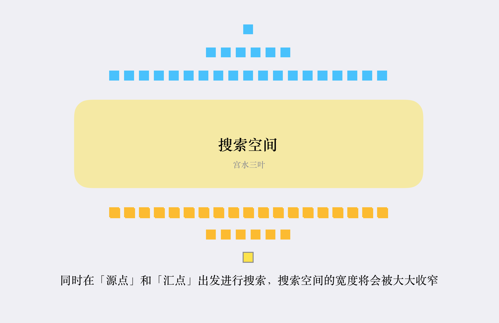

# BFS（一）

核心思想，把一些问题抽象成图，从一个点开始，向四周扩散，一般来说，写 BFS 算法都是用“队列”这种数据结构，每次将一个节点周围的所有节点加入队列。

BFS 和 DFS 最主要的区别：**BFS 找到的路径一定是最短的，但代价是空间复杂度比 DFS 大很多。**

常见场景：**在一幅图中从起点 start 到终点 target 的最近距离。**比如走迷宫，单词替换字母，连连看等等。

## 代码框架

```java 
int BFS(Node start,Node target) {
    Queue<Node> q; //核心数据结构
    Set<Node> visited;  //避免走回头路
    
    q.offer(start);  //将起点加入队列
    visited.add(start);  
    int step = 0;  //记录扩散的步数
    
    while(q not empty) {
        int sz = q.size();
        //将队列中的所有节点向四周扩散
        for(int i=0;i<sz;i++) {
            Node cur = q.poll();
            //是否到达终点
            if(cur is target) {
                return step;
            }
            //将cur相邻节点加入队列
            for(Node x: cur.adj()) {
                if(x not in visited) {
                    q.offer(x);
                    visited.add(x);
                }
            }
        }
        //更新步数
        step++;
    }
}
```

cur.adj() 泛指与 cur 相邻的节点，visited 的主要作用就是防止走回头路，但是像一般的二叉树结构，没有子节点到达父节点指针，就不需要 visited。

## 二叉树的最小高度

计算二叉树的根节点到叶子节点的最短距离。起点就是 root 根节点，终点就是最靠近根节点的那个叶子节点。

代码：

```java
public int minDepth(TreeNode treeNode) {
    Queue<TreeNode> q = new LinkedList<>();
    q.add(treeNode);
    int depth = 1;
    while (!q.isEmpty()) {
        int size = q.size();
        for (int i = 0; i < size; i++) {
            //q.offer(q.)
            TreeNode poll = q.poll();
            if (poll.left == null && poll.right == null) {
                return depth;
            }
            if (poll.left != null) {
                q.offer(poll.left);
            }
            if (poll.right != null) {
                q.offer(poll.right);
            }
        }
        //记得这边要累加
        depth++;
    }
    return depth;
}
```

引出两个问题：

1. BFS 可以找到最短路径，DFS 可以吗？

   BFS 来说，depth 每增加一次，队列中的所有节点都向前迈一步，这个逻辑保证了一旦找到了一个终点，走的步数都是最少的。BFS 算法的时间复杂度最坏是 O(N)。

   DFS 也可以找到最短路径，但是它是通过递归的堆栈记录走过的路径，要把二叉树中所有树杈都探索完，然后对比出路径最少的那一个，而 BFS 是可以在还没有完全遍历出这棵树的情况下得到答案，相对来说，BFS 的效率更高。

2. DFS 为啥要存在？

   简单来说 BFS 的空间复杂度较高，对 DFS 来说，空间复杂度无非就是递归堆栈，在最坏的情况下顶多就是树的高度 O(logN)，而 BFS 来说最坏的空间复杂度为 O(N)。

## 密码锁的最少次数

[题目内容](https://leetcode-cn.com/problems/open-the-lock/)：

你有一个带有四个圆形拨轮的转盘锁。每个拨轮都有10个数字： '0', '1', '2', '3', '4', '5', '6', '7', '8', '9' 。每个拨轮可以自由旋转：例如把 '9' 变为 '0'，'0' 变为 '9' 。每次旋转都只能旋转一个拨轮的一位数字。

锁的初始数字为 '0000' ，一个代表四个拨轮的数字的字符串。

列表 deadends 包含了一组死亡数字，一旦拨轮的数字和列表里的任何一个元素相同，这个锁将会被永久锁定，无法再被旋转。

字符串 target 代表可以解锁的数字，你需要给出解锁需要的最小旋转次数，如果无论如何不能解锁，返回 -1 。

**思路：对于一串数字，比如'0000'来说，他一次一共有 2*4 = 8 中的旋转可能，依次穷举，也就是说，对于这个节点来说，每个节点有8个相邻的节点，有两个注意点：1.不能走回头路，因为是最少。2.遇到死亡数字时，跳过，不要进行任何处理。**

伪代码：

```java
String plusOne(String s, int j) {
    char[] ch = s.toCharArray();

    if (ch[j] == '9') {
        ch[j] = '0';
    } else {
        ch[j] += 1;
    }
    return new String(ch);
}

String minusOne(String s, int j) {
    char[] ch = s.toCharArray();
    if (ch[j] == '0') {
        ch[j] = '9';
    } else {
        ch[j] -= 1;
    }
    return new String(ch);
}

void BFS(String target) {
    Queue<String> q = new LinkedList<>();
    q.offer('0000');
    int res= 0;
    while(!q.isEmpty()) {
        int size = q.size();
        for(int i = 0;i<size;i++) {
            String s=q.poll();
            if(s.equals(target)) {
                //。。找到
            }
            for(int x = 0;x<4;x++) {
                q.offer(plusOne(s,x));
                q.offer(minusOne(s,x));
            }
        }
        //步骤加一
        res++;
    }
}
```

全代码：

```java
public int openLock(String[] deadends, String target) {
    Set<String> deadSet = new HashSet<>(Arrays.asList(deadends));
    Set<String> visited = new HashSet<>();
    Queue<String> q = new LinkedList<>();
    q.offer("0000");
    int setp = 0;
    while (!q.isEmpty()) {
        int sz = q.size();
        for (int i = 0; i < sz; i++) {
            String poll = q.poll();
            //进行死亡密码的校验
            if (deadSet.contains(poll)) {
                continue;
            }
            if (poll.equals(target)) {
                return setp;
            }
            //将这个节点分布的其他节点加进来 已经加进去过的就不需要了
            for (int j = 0; j < 4; j++) {
                String s = plusOne(poll, j);
                if (!visited.contains(s)) {
                    q.offer(s);
                    visited.add(s);
                }
                String s1 = minusOne(poll, j);

                if (!visited.contains(s1)) {
                    q.offer(s1);
                    visited.add(s1);
                }
            }
        }
        setp++;
    }
    return -1;
}
```

## 双向 BFS

**传统的 BFS 框架是从起点开始向四周扩散，遇到终点时停止；而双向 BFS 则是从起点和终点同时开始扩散，当两边有交集的时候停止。**

使用朴素 BFS 进行求解时，队列中最多会存在两层的搜索节点，因此搜索空间的上限取决于目标节点所在的搜索层次的深度所对应的宽度。下图展示了朴素 BFS 可能面临的搜索空间爆炸问题：


而双向 BFS 同时从两个方向开始搜索，**一旦搜索到相同的值，意味着找到了一条联通起点和终点的最短路径**



这里先展示下别人的 BFS 逻辑，之后补上三叶姐的实现思路。

```java
public int openLock2(String[] deadends, String target) {
    Set<String> deadSet = new HashSet<>(Arrays.asList(deadends));

    //用集合不用队列
    Set<String> q1 = new HashSet<>();
    Set<String> q2 = new HashSet<>();

    Set<String> visited = new HashSet<>();

    q1.add("0000");
    q2.add(target);
    int step = 0;

    while (!q1.isEmpty() && !q2.isEmpty()) {
        //在遍历的过程中不能修改哈希集合
        //用temp存储q1的扩散结果
        Set<String> temp = new HashSet<>();
        for (String cur : q1) {
            if (deadSet.contains(cur)) {
                continue;
            }
            //如果q1和q2有交集 则表示有一条联通的路径的 返回结果
            if (q2.contains(cur)) {
                return step;
            }
            visited.add(cur);

            for (int j = 0; j < 4; j++) {
                String up = plusOne(cur, j);
                if (!visited.contains(up)) {
                    temp.add(up);
                }
                String down = minusOne(cur, j);
                if (!visited.contains(down)) {
                    temp.add(down);
                }
            }
        }
        step++;

        q1 = q2;
        q2 = temp;

    }
    return -1;
}
```

技巧点：

1. 不使用队列，而是使用 Set，可以快速的判断是否有交集
2. while 循环的是去交换 q1 和 q2 的内容，所以只要默认扩散 q1，就相当于轮流扩散 q1 和 q2。

还有一个额外的技巧点：

```java
while(!q1.isEmpty()&&!q2.isEmpty()) {
    if(q1.size()>q2.size()) {
        Set<String> tempFOrSwap = q1;
        q1=q2;
        q2=tempForSwap;
    }
}
```

也就是每次去操作数据较少的那个 Set，因为 Set 中的数据越多，占用的空间增长速度就越快。
