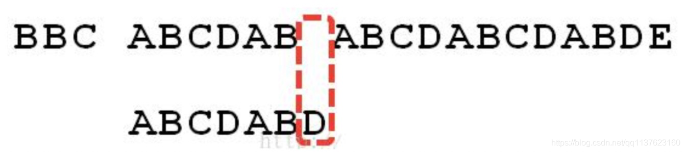
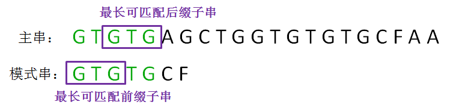
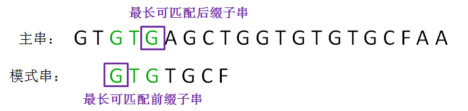
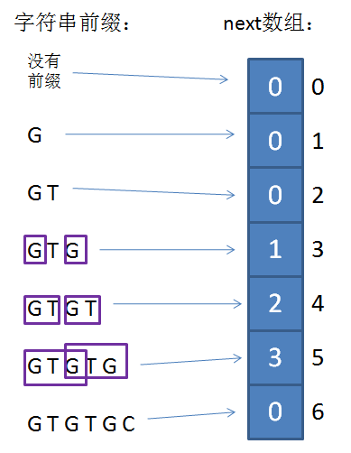

# KMP 算法

一个基本事实是，当空格与 D 不匹配时，你其实知道前面六个字符是”ABCDAB”。 KMP 算法的想法是，设法利用这个已知信息，不要把”搜索位置”移回已经比较过的位置，继续把它向后移，这 样就提高了效率。

---

KMP 算法的整体思路：在已匹配的前缀当中寻找到最长可匹配后缀子串和最长可匹配前缀子串，在下一轮直接把两者对齐，从而实现模式串的快速移动。

在下一轮的比较时，只有把这两个相同的片段对齐，才有可能出现匹配。这两个字符串片段，分别叫做**最长可匹配后缀子串**和**最长可匹配前缀子串**。

按照第一轮的思路，我们来重新确定最长可匹配后缀子串和最长可匹配前缀子串：

这样循环下去即可。

## next 数组

涉及到如何找到最长可匹配后缀子串和最长可匹配前缀子串，next 数组也是整个算法中最关键的一部分。

先将它视为一维数组，数组的下标代表了**“已匹配前缀的下一个位置”**，元素的值则是**“最长可匹配前缀子串的下一个位置”**。

> 已匹配前缀的下一个位置，可以理解为坏字符出现的位置。
>
> 最长可匹配前缀子串的下一个位置，也就是下一个要与坏字符进行匹配的位置。

举个例子，主串中的字符为：GTGTGB……，已匹配的前缀为 GTGTG，坏字符出现在第五位（从零开始算），查询可得 next[5] = 3,也就是说坏字符 B 要和模式串中第三位的字符进行匹配，也就是 T,进行下一轮的匹配。

如何去生成这个数组呢？其实数组的生成和主串没有关系，只和模式串有关系，也就是说只要模式串定下来了，next 数组就知道了。

