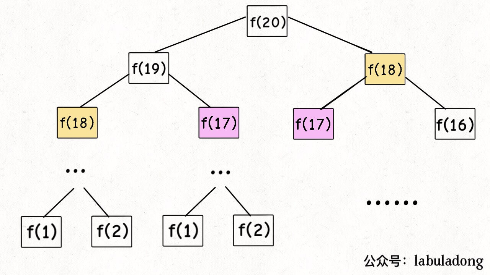

# 动态规划

动态规划的一般形式就是求最值，动态规划的核心问题是穷举，但是简单的穷举会存在一个问题，那就是**重叠子问题**，需要备忘录或者“DP table”来优化穷举过程。一般来说，一定会具有“**最优子结构”**，这样才能通过子问题的最值得到原问题的最值。还有一个重点就是**状态转移方程**。

1. 这个问题有什么 base case（最简单的情况）是什么？
2. 这个问题有什么状态？
3. 对于每个状态，可以做出什么选择使得状态发生变化？
4. 如何定义dp数组/函数的含义来表现“状态”和“选择”？

## 斐波那契数列

1. 暴力递归：

   ```java
   int fib(int n) {
       if(n==0) return 0;
       if(n==1 || n==2) return 1;
       return fib(n-1)+fib(n-2);
   }
   ```

   > 类似于上楼梯的问题：在只能一步和两步的情况下，问到N层楼梯有多少种走法？
   >
   > 当n>2时，f(n)  = f(n-1)+f(n-2) ， f(1) =1 ，f(2)=2。
   >
   > 因为到达第n层楼梯的前提条件为：到达了n-1层楼梯或者n-2层楼梯，只有这样下一步才有可能到达n层楼梯。

   递归树：

   

   **递归的时间复杂度：子问题的个数乘以解决一个子问题需要的时间。**

   二叉树的节点总数为指数级别的，所以时间复杂度为O(2^n)，指数级别。存在大量的重复计算。即重叠子问题。

2. 带备忘录的递归解法

   ```java
   int fib(int n) {
       if (n == 0) return 0;
       int[] ints = new int[n + 1];
       return helper(ints, n);
   }
   
   int helper(int[] x, int n) {
       if (n == 1 || n == 2) {
           return 1;
       }
       if (x[n] != 0) {
           return x[n];
       }
       //这个函数的第一次递归会将所有的x[0]到x[n-1]都算出来
       x[n] = helper(x, n - 1) + helper(x, n - 2);
       return x[n];
   }
   ```

   本算法不涉及到冗余计算，数量和输入规模n成正比，时间复杂度为O(N)。和刚才的暴力算法相比，算是降维打击了。

   这种算法叫做**自顶向下**，想得到f(20)的解，就先算出f(19)和f(18)的值，以此推算到基本的 f(1)和f(0)。并且仍然属于递归！！

   还有一种是自底向上的，从f(1),f(0)开始算f(3),f(4)……直到算到最后的f(20)，这就是为什么动态规划一般都脱离了递归，而是由循环迭代完成计算的关键所在。

3. dp数组的迭代算法

   ```java
   int fib3(int n) {
       int[] ints = new int[n+1];
       ints[0] = 0;
       ints[1] = 1;
       ints[2] = 1;
       for (int x = 3; x <= n; x++) {
           ints[x] = ints[x - 1] + ints[x - 2];
       }
       return ints[n];
   }
   ```

   如何自下而上：

   

   状态转移方程：把f(n)想为一个状态，这个状态是有f(n-1)和f(n-2)转换而来的，这就叫状态转移方程。 

   > return f(n-1)+f(n-2) 和 dp[i]=dp[i-1]+dp[i-2]以及dp table的初始化方式，都是对这个状态转移方程的不同表现形式。

   最后一个细节问题，我们发现上面的状态转移方程中的f(n)只和f(n-1)和f(n-2)有关，只要想办法存储这两个状态就好了，这个过程叫做“**状态压缩**”。

   ```java
   int fib4(int n) {
       if (n == 0) return 0;
       if (n == 1 || n == 2) return 1;
       int prev = 1, next = 1;
       for (int x = 3; x <= n; x++) {
           int sum = prev + next;
           prev = next;
           next = sum;
       }
       return next;
   }
   ```

   

