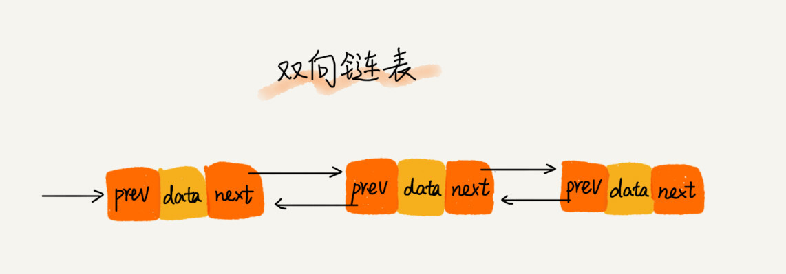

# 数组和链表

两种非常基本的数据结构。

## 数组

一种线性的数据结构，而且在实现上也是用的连续的内存空间，所以**寻址读取数据比较容易，插入和删除比较困难**，插入和删除会变更数组中数据的位置。

> 是一种**线性表**数据结构。他用一组**连续的内存空间**，来存储一组具有**相同类型的数据**。

**查询的的时间复杂度为O(1)，插入或删除的时间复杂度为O(N)。**

> 上面的表述是不准确的。数组是适合查找操作，但是查找的时间复杂度并不为 O(1) 。即便是排好序的数组，用二分查找，时间复杂度是O(logn)。正确的表述：，数组是支持随机访问，根据下标随机访问的时间复杂度为O(1)。

在 java 中，ArrayList 底层就是使用的数组。

ArrayList 最大的优势就是可以将**很多数组操作的细节封装起来**，比如数组插入、删除数据时需要搬移其他数据等。**还有就是支持动态扩容（1.5倍），在创建ArrayList的时候实现指定数据大小**。

相对于ArrayList容器，数组的优势：

- ArrayList 无法存储基本类型，比如int、long，需要封装为 Integer、Long类，而 Autoboxing、Unboxing 则有一定的性能消耗，所以如果特别关注性能，或者希望使用基本类型，就可以选用数组。

- 如果数组大小事先已知，并且对数据的操作非常简单，用不到 ArrayList 提高的大部分 API，也可以直接使用数组。

- 当要表示多维数组是，用数组往往会更加直观，比如 Object[][] array;而用容器的话需要这样定义：

  ArrayList<ArrayList\<object>>

## 链表

链表的存储并不需要连续的内存空间，因为节点中存储了下一个节点的引用地址，所以当进入删除和插入的时候，只需要改变节点直接的应用即可，但是查询的时候却需要从头节点或者尾节点遍历地去查找。

**查询的时间复杂度为O(N)，插入或删除的时间复杂度为O(1)。**

- 单向链表

  

  每个节点都包含下一节点的指针。

  - 循环链表

    实际上，循环链表也很简单。它跟单链表唯一的区别就在尾结点。我们知道，单链表的尾结点指针指向空地址，表示这就是最后的结点了。而循环链表的尾结点指针是指向链表的头结点。

    

- 双向链表

  每个节点都有两个指针，分别指向直接后继和直接前驱。从任意节点开始，都可以很方便的访问它的前驱节点和后继节点，一般构造双向循环链表。**双向链表需要额外的两个空间来存储后继节点和前驱节点，存储同样多的数据，双向链表要比单链表占用更多的内存空间**。

  

  从结构上来看，双向链表可以支持 O(1) 时间复杂度的情况下找到前驱结点，正是这样的特点，也使双向链表在某些情况下的插入、删除等操作都要比单链表简单、高效。因为双向链表中的结点已经保存了前驱结点的指针，不需要像单链表那样遍历。

  > 除此之外，对于一个有序链表，双向链表的按值查询的效率也要比单链表高一些。因为我们可以记录上次查找的位置 p，每次查询时，根据要查找的值与 p 的大小关系，决定是往前还是往后查找，所以平均只需要查找一半的数据。
  
  
  
  java 中的 LinkedList 就是双向链表，通常可以作为栈或队列使用。他也是 Deque(双端队列) 和 Queue（队列）的实现类。
  
  在使用 Queue 接口的时候，**避免使用 Collection 的 add() 和 remove() 方法，而是使用 offer() 来加入元素和使用 poll() 来获取并移出元素。他们的优点使用过返回值可以判断成功与否，add() 和 remove() 方法在失败的时候会抛出异常。**
  
  而 Deque 接口（继承了 Queue）作为双端队列更强大：可作为队列，FIFO(先进先出)，头进尾出；也可以作为栈，LIFO(后进先出)，头进头出。**目前也是推荐 Deque 来替代 Stack 类。**

> 数组使用的是连续的内存空间，可以借助 CPU 的缓存机制，预读数组中的数据，所以访问效率更高，而链表在内存中并不是连续存储，所以对 CPU 缓存不友好，没办法有效预读。
>
> CPU在从内存读取数据的时候，会先把读取到的数据加载到CPU的缓存中。而CPU每次从内存读取数据并不是**只读取那个特定要访问的地址，而是读取一个数据块(这个大小我不太确定。。)并保存到CPU缓存中**，然后下次访问内存数据的时候就会先从CPU缓存开始查找，如果找到就不需要再从内存中取。这样就实现了比内存访问速度更快的机制，也就是CPU缓存存在的意义:为了弥补内存访问速度过慢与CPU执行速度快之间的差异而引入。
>
> 对于数组来说，存储空间是连续的，所以在加载某个下标的时候可以把以后的几个下标元素也加载到CPU缓存这样执行速度会快于存储空间不连续的链表存储。

## 跳表

对于单链表来说，即使数据是排好序的，想要查询其中的一个数据，只能从头开始遍历链表，这样效率很低，时间复杂度很高，为O(N)。

为了解决这个痛点，跳表的数据结构诞生了。

> 跳表中的数据一定是排好序的。

为链表建立一个索引，这样查找起来更快，如下图所示：

我们要查询红色结点，我们查询的路线即黄线表示出的路径查询，每一级最多遍历两个结点即可。

跳表的主要应用有 redis 等。主要优点是可以根红黑树，AVL等平衡树一样，做到比较稳定地插入、查询和删除。理论插入查询删除的算法时间复杂度为O(logN)。

## 实现 LRU 算法

常见的策略有三种：先进先出策略FIFO（First in,First out）、最少使用策略 LFU（LEASE Frequently Uesd）、最近最少使用策略 LRU（Lease Recently Used）。

维护一个有序单链表，越靠近链表尾部的节点是越早之前访问的。当有一个新的数据被访问时，我们从链表头开始顺序遍历链表。

1. 如果此数据之前已经被缓存在链表中，我们遍历得到这个数据对应的节点，并将其从原来的位置删除，然后再插入到链表的头部。
2. 如果此数据没有在缓存链表中，又可以分为两种情况：
   - 如果此时缓存未满，则将此节点直接插入到链表的头部
   - 如果此时缓存已满，则将链表尾部的节点删除，将新的数据节点插入链表的头部。

因为不管缓存有没有满，我们都需要遍历一遍链表，所以这种基于链表的实现思路，缓存访问的时间复杂度为 O(n)。

如果想优化这个思路的话，可以引入散列表来记录每个数据的位置，将缓存访问的时间复杂度降到 O(1)。

