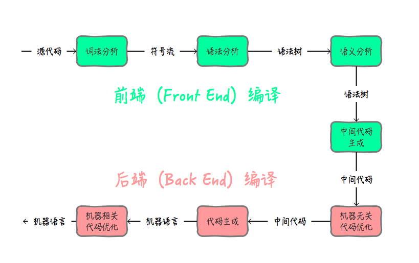

# HotSpot 中的编译器与解释器

> 时间：2020/4/14  
>
> 以后决定将写这些的时间全部更新上去，以记录自己的成长吧。

- 编译器在编译的过程中，读入源程序文件，输出一份等价的二进制可执行文件，就和笔译工作者一样，他们都会输出一份翻译后的文件。
- 解释器在解释的过程中，读入源程序文件，输出的是执行的结果，就和口译工作者一样，他们输出的是已经完成翻译的结果。

**输出的不同是这两者最大的区别，一个会输出用于执行的文件，另一个只会输出运行的结果；**

**解释型语言启动速度快，但启动后的运行效率不高，而编译型语言启动速度慢，但启动后运行效率高，这也是两者一个极大的区别。**

特点：

- 解释器：跨平台、启动速度快、开发效率高。但是执行速度慢，执行效率低。
- 编译器：执行速度快、执行效率高。但是平台相关性高，编译速度（启动速度）慢，开发效率低。

`Java` 中编译器比较多，它包含*一个前端编译器，一个后端编译器（`JIT`）以及一个静态预编译器（`AOT`）*。

- 前端编译器的功能是从源代码生成 `Java` 字节码，也就是中间代码；
- 后端编译器，也叫作即时编译器（`JIT`）它是包含在了 `JVM` 中，用于在执行的过程中，将热点代码（也就是执行次数比较多的代码）转化为本地机器码，并做一些优化，以加速执行效率。
- 静态预编译器（`AOT`）它是直接将 `java` 源代码编译成本地机器码，也就是传统意义上的编译器，但用的不多，因为这样会使 `java` 的一些特性丢失。

## 编译器

`JVM`中包含一个解释器和多个编译器，在目前阶段，主流的编译分为前端编译和后端编译。后端编译虽然这不是`JVM`虚拟机的规范，但是这些都是衡量一个高质量虚拟机的指标之一。

对性能的优化都是在后端编译上的。开发阶段的优化（比如说语法糖）都是在前端编译体现的。可以这样说：**后端编译是运行期的优化过程，支撑了程序执行效率的不断提升；而前端编译器在编译期的优化过程，则是支撑程序员的编码效率。**

前端编译的最终产物是`中间代码`，这个中间代码所指的就是`Java`的字节码文件。但是这个文件还是不能被处理器运行的能力，还需要一层`JVM`的加工。

## 解释器

解释器顾名思义就是解释代码用的，上面提到了前端编译的最终产物是中间代码，这时的中间代码不具有被处理器识别并执行的能力，解释器的职责就是将此时的字节码**逐条解释**成处理器能够识别的机器码指令。

所以从这里也可以解释，为什么高级语言执行效率会这么慢，主要就是多了这个解释的过程，像 `Java`、`Python` 等执行效率都比较慢。

所以通俗讲：解释器在 `Java` 中的作用充当了 `Java` 程序和计算机之间的“翻译官”角色，将计算机“看”不懂的语言翻译成它能够“看”懂并执行的机器语言。

`Java` 中的解释器与 `JIT` (后端编译)一起打包，作为 `JVM` 中的*执行引擎*，解释器主要将字节码进行解释执行，同时配合 `JIT` 进行代码的优化操作。

> 当程序需要迅速启动和执行的时候，解释器可以首先发挥作用，省去编译的时间，立即运行。当程序启动之后，随着时间的推移，编译器逐渐发挥作用，把越来越多的代码编译成本地代码，可以减少解释器的中间损耗，获得更高的执行效率。

后续会大概记录一下 `JIT` 技术具体的优化策略。

参考文章：https://www.jianshu.com/p/96d65e8f4cbf

​                   https://zhuanlan.zhihu.com/p/107382276

​                   https://blog.csdn.net/qq_34812009/article/details/89020419

> 2020/5/12 更新

- 编译器：编译器是一种计算机程序，负责把一种编程语言编写的源码转换成另外一种计算机代码，后者往往是以二进制的形式被称为目标代码( `object code`)。这个转换的过程通常的目的是生成可执行的程序。

  编译器的产出是「另外一种代码」，然后这些代码等着被别人拿来执行，如果还不能直接被执行，那么还需要再编译或解释一遍，再交由计算机硬件执行。
  编译器，往往是在「执行」之前完成，产出是一种可执行或需要再编译或者解释的「代码」。

- 解释器

  在计算机科学中，解释器是一种计算机程序，它直接执行由编程语言或脚本语言编写的代码，并不会把源代码预编译成机器码。一个解释器，通常会用以下的姿势来执行程序代码：

  分析源代码，并且直接执行。
  把源代码翻译成相对更加高效率的中间码，然后立即执行它。
  执行由解释器内部的编译器预编译后保存的代码
  可以把解释器看成一个黑盒子，我们输入源码，它就会实时返回结果。
  不同类型的解释器，黑盒子里面的构造不一样，有些还会集成编译器，缓存编译结果，用来提高执行效率（例如 `Chrome V8` 也是这么做的）。
  解释器通常是工作在「运行时」，并且对于我们输入的源码，是一行一行的解释然后执行，然后返回结果。

## 表现

编译器把源代码转换成其他的更低级的代码(例如二进制码、机器码)，但是不会执行它。
解释器会读取源代码，并且直接生成指令让计算机硬件执行，不会输出另外一种代码。

## 性能

编译器会事先用比较多的时间把整个程序的源代码编译成另外一种代码，后者往往较前者更加接近机器码，所以执行的效率会更加高。时间是消耗在预编译的过程中。

解释器会一行一行的读取源代码，解释，然后立即执行。这中间往往使用相对简单的词法分析、语法分析，压缩解释的时间，最后生成机器码，交由硬件执行。解释器适合比较低级的语言。但是相对于预编译好的代码，效率往往会更低。如何减少解释的次数和复杂性，是提高解释器效率的难题。

## 字节码

字节码严格来说不算是编程语言，而是高级编程语言为了种种需求（可移植性、可传输性、预编译等）而产生的中间码（`Intermediate Code`）。

它是由一堆指令集组成的代码，例如在 `javac` 编译过后的 `java` 源码产生的就是字节码。

源码在编译的过程中，是需要进行「词法分析 → 语法分析 → 生成目标代码」等过程的，在预编译的过程中，就完成这部分工作，生成字节码。

然后在后面交由解释器（这里通常指编程语言的虚拟机）解释执行，省去前面预编译的开销。

## 机器码

机器码是一组可以直接被 `CPU` 执行的指令集，每一条指令都代表一个特定的任务，或者是加载，或者是跳转，亦或是计算操作等等。

所有可以直接被 `CPU` 执行的程序，都是由这么一系列的指令组成的。机器码可是看作是编译过程中，最低级的代码，因外再往下就是交由硬件来执行了。当然机器码也是可以被编辑的，但是以人类难以看懂的姿势存在，可读性非常差。

从熟悉的编程语言的角度来看看

从左往右看，

以 `Java` 为例，我们在文本编译器写好了 `Java` 代码，交由「编译器」编译成 `Java Bytecode`。然后 `Bytecode` 交由 `JVM` 来执行，这时候 `JVM` 充当了「解释器」的角色，在解释 `Bytecode` 成 `Machine Code` 的同时执行它，返回结果。

以 `BASIC` 语言（早期的可以由计算机直译的语言） 为例，通过文本编译器编写好，不用经历「编译」的过程，就可以直接交由操作系统内部来进行「解释」然后执行。

以 C 语言为例，我们在文本编译器编写好源代码，然后运行 `gcc hello.c` 编译出 `hello.out` 文件，该文件由一系列的机器指令组成的机器码，可以直接交由硬件来执行。

此次补充内容来源：https://blog.csdn.net/weixin_43059285/article/details/104650632

