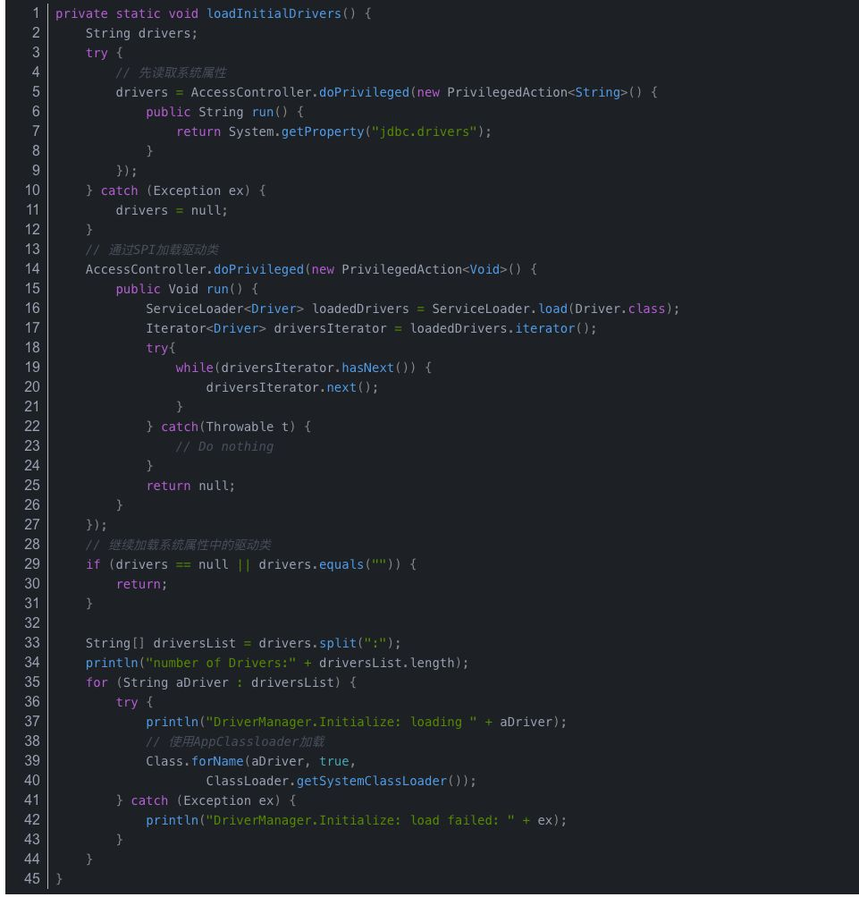

# 类加载器

> 时间：2020/3/29

“通过一个类的全限定名来获取描述该类的二进制字节流”这个动作放到虚拟机外部去实现。这个动作的代码被称为“类加载器（`Class Loader`）”

## 类加载器

对于任意一个类，都必须由加载它的类加载器和这个类本身译器共同确立其在`Java`虚拟机的唯一性每一个类加载器，都拥有一个独立的类名称空间。

也就是说比较两个类是否“相等”，必须在同一个类加载器加载的前提下才有意义，否则即使两个类来源同一个`Class`文件，被同一个虚拟机加载，只要加载它们的类加载器不同，它们就必定不相等。

## 双亲委派模型

定义：

当某个类加载器需要加载某个`.class`文件时，它首先把这个任务委托给他的上级类加载器，递归这个操作，如果上级的类加载器没有加载，自己才会去加载这个类。

`JDK8`及之前版本来介绍三层类加载器。

* 启动类加载器（`BootStrap Class Loader`）:负责加载存放在`JAVA_HOME\lib`目录，而且是虚拟机能够识别的类库加载到虚拟机的内存中。启动类加载其无法被`Java`程序直接引用，因为它是用`C++`来实现的。
* 扩展类加载器（`Extension Class Loader`）:这个加载器是以`Java`代码实现的，负责加载`JAVA_HOME\lib\ext`目录中，是一种`Java`系统类库的扩展机制，允许用户将具有通用性的类库放置在`ext`目录以扩展`Java SE` 的功能，`JDK9`之后，这种扩展机制被模块化带来的天然的扩展能力所取代。
* 应用程序类加载器（`Application Class Loader`）:也是用`Java`代码实现的，它负责加载用户类路径上所有的类库，如果应用程序中没有定义过自己的类加载器，一般情况下这个就是程序默认的类加载器。


或者看下图：


`Java9`之前的应用都是由这三类加载器互相配合来完成加载的。自定义类加载器典型的有增加除了磁盘位置之外的`Class`文件来源，或者通过类加载器实现类的隔离、重载等功能。

类加载器的父子关系并不是继承的关系实现的，而是使用组合关系来复用父加载器的代码。

### 工作过程

如果一个类加载器收到了类加载的请求，他首先不会自己尝试加载这个类，而是把这个请求委派给父类加载器去完成，每一个层次的类加载器都是如此，因此所有的加载请求最终都应该传送到最顶层的启动类加载器中，只有当父加载器反馈自己无法完成这个加载请求，子加载器才会尝试自己去完成加载。

> 好处：`Java`中的类随着他的类加载器一起具备了一种带有优先级的层次关系。比如`java.lang.Object`，它存放在`rt.jar`中，无论哪一个类加载器要加载这个类，最终都会被委派给最顶端的启动类加载器进行加载。
>
> 可以避免类的重复加载，另外也避免了java的核心API被篡改。


> `Java9`模块化的关键目标-----可配置的封装隔离机制


> 时间 2020/5/13 更新

在实际的应用中双亲委派解决了java 基础类统一加载的问题，但是却着实存在着一定的缺陷。**jdk中的基础类作为用户典型的api被调用，但是也存在api调用用户的代码的情况**，典型的如SPI代码。

所以jdk开发人员就引入了**线程上下文类加载器（Thread Context ClassLoader）**，这类类加载器可以通过java.lang.Thread 类的setContextClassLoader方法进行设置。

## 例子

1. JDBC

   在JDBC4.0以后，开始支持使用spi的方式来注册这个Driver，具体做法就是在mysql的jar包中的META-INF/services/java.sql.Driver 文件中指明当前使用的Driver是哪个，然后使用的时候就直接这样就可以了：

   ```java
   Connection conn= DriverManager.getConnection("jdbc:mysql://localhost:3306/mydb?characterEncoding=GBK", "root", "");
   ```

   可以看到这里直接获取连接，省去了Class.forName()注册过程。步骤：

   第一，从META-INF/services/java.sql.Driver文件中获取具体的实现类名“com.mysql.jdbc.Driver”

   第二，加载这个类，这里肯定只能用Class.forName("com.mysql.jdbc.Driver")来加载

   好了，问题来了，Class.forName()加载用的是调用者的Classloader，这个调用者DriverManager是在rt.jar中的，ClassLoader是启动类加载器，而com.mysql.jdbc.Driver肯定不在<JAVA_HOME>/lib下，所以肯定是无法加载mysql中的这个类的。**这就是双亲委派模型的局限性了，父级加载器无法加载子级类加载器路径中的类。**

   按照目前情况来分析，这个mysql的drvier只有应用类加载器能加载，那么我们只要在启动类加载器中有方法获取应用程序类加载器，然后通过它去加载就可以了。这就是所谓的线程上下文加载器。
    **线程上下文类加载器可以通过Thread.setContextClassLoaser()方法设置，如果不特殊设置会从父类继承，一般默认使用的是应用程序类加载器**

   **很明显，线程上下文类加载器让父级类加载器能通过调用子级类加载器来加载类，这打破了双亲委派模型的原则**。

   以下的代码是DriverManager的初始化方法loadInitialDrivers，大家可以从中看到先是获取jdbc.drivers属性，得到类的路径。然后通过系统类加载器加载。

   

   然后我们看下ServiceLoader.load()的具体实现：

   ```java
   public static <S> ServiceLoader<S> load(Class<S> service) {
       ClassLoader cl = Thread.currentThread().getContextClassLoader();
       return ServiceLoader.load(service, cl);
   }
   public static <S> ServiceLoader<S> load(Class<S> service,
                                           ClassLoader loader){
       return new ServiceLoader<>(service, loader);
   }
   ```

   可以看到核心就是拿到线程上下文类加载器，然后构造了一个ServiceLoader,接下来，DriverManager的loadInitialDrivers()方法中有一句**driversIterator.next();**,它的具体实现如下：

   ```java
   private S nextService() {
       if (!hasNextService())
           throw new NoSuchElementException();
       String cn = nextName;
       nextName = null;
       Class<?> c = null;
       try {
           //此处的cn就是产商在META-INF/services/java.sql.Driver文件中注册的Driver具体实现类的名称
           //此处的loader就是之前构造ServiceLoader时传进去的线程上下文类加载器
           c = Class.forName(cn, false, loader);
       } catch (ClassNotFoundException x) {
           fail(service,
                "Provider " + cn + " not found");
       }
       //省略部分代码
   }
   ```

   现在，我们成功的做到了通过线程上下文类加载器拿到了应用程序类加载器（或者自定义的然后塞到线程上下文中的），同时我们也查找到了厂商在子级的jar包中注册的驱动具体实现类名，这样我们就可以成功的在rt.jar包中的DriverManager中成功的加载了放在第三方应用程序包中的类了。

这个时候我们再看下整个mysql的驱动加载过程:

- 第一，获取线程上下文类加载器，从而也就获得了应用程序类加载器（也可能是自定义的类加载器）
- 第二，从META-INF/services/java.sql.Driver文件中获取具体的实现类名“com.mysql.jdbc.Driver”
- 第三，通过线程上下文类加载器去加载这个Driver类，从而避开了双亲委派模型的弊端

很明显，mysql驱动采用的这种spi服务确确实实是破坏了双亲委派模型的，毕竟做到了父级类加载器加载了子级路径中的类。

