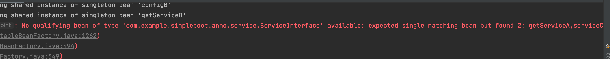

# @Import

参考文章：

[__https://zhuanlan.zhihu.com/p/147025312__](https://zhuanlan.zhihu.com/p/147025312)

`@Import`是`Spring`基于 Java 注解配置的主要组成部分。`@Import`注解提供了`@Bean`注解的功能，同时还有原来`Spring`基于 xml 配置文件里的`<import>`标签组织多个分散的xml文件的功能，当然在这里是组织多个分散的`@Configuration`的类。他只作用于类上。

## 三种方式引入

### 直接引入

```java
@Import(ConfigB.class)
@Configuration
class ConfigA {
    @Bean
    @ConditionalOnMissingBean
    public ServiceInterface getServiceA() {
        return new ServiceA();
    }
}
```

这种方式的优先于本身的类定义加载。

### 指定实现`ImportSelector`(以及`DefferredServiceImportSelector`)的类，用于个性化加载。

指定实现`ImportSelector`的类，通过`AnnotationMetadata`里面的属性，动态加载类。`AnnotationMetadata`是`Import`注解所在的类属性（**如果所在类是注解类，则延伸至应用这个注解类的非注解类为止**）。

```java
public class ServiceImportSelector implements ImportSelector {
    @Override
    public String[] selectImports(AnnotationMetadata importingClassMetadata) {
        return new String[]{"com.example.simpleboot.anno.ConfigB"};
    }
}
//这里直接指定ImportSelector的接口实现类，是具体的Bean类的全限定名称
@Import(ServiceImportSelector.class)
@Configuration
class ConfigA {
    @Bean
    @ConditionalOnMissingBean
    public ServiceInterface getServiceA() {
        return new ServiceA();
    }
}

public static void main(String[] args) {
    ApplicationContext ctx = new AnnotationConfigApplicationContext(ConfigA.class);
    ServiceInterface bean = ctx.getBean(ServiceInterface.class);
    bean.test();
}
```

这种方式也是优先于本身的类定义加载，一般的，如果框架中给予 AnnotationMetadata的参数实现动态加载类，一般会写一个额外的 Enable 注解配合使用。

```java
@Retention(RetentionPolicy.RUNTIME)
@Documented
@Target(ElementType.TYPE)
@Import(ServiceImportSelector2.class)
public @interface EnableService {
    String name();
}

public class ServiceImportSelector2 implements ImportSelector {
    @Override
    public String[] selectImports(AnnotationMetadata importingClassMetadata) {
        //这里的importingClassMetadata指的就是被Import修饰的类属性，如果所在类是注解类，则延伸至应用这个注解类的非注解类为止
        //也就是将EnableService注解上的属性全部拿到 放到这个Map中
        Map<String, Object> annotationAttributes = importingClassMetadata.getAnnotationAttributes(EnableService.class.getName(), true);
        String name = (String) annotationAttributes.get("name");
        if(Objects.equals(name,"B")) {
            return new String[]{"com.example.simpleboot.anno.ConfigB"};
        }
        return new String[0];
    }
}
```

### `ImportBeanDefinitionRegistrar`的类，用于个性化加载

与`ImportSelector`用法与用途类似，但是如果我们想重定义`Bean`，例如动态注入属性，改变`Bean`的类型和`Scope`等等，就需要通过指定实现`ImportBeanDefinitionRegistrar`的类实现。

```java
public class ServiceC implements ServiceInterface{
    String name;
    ServiceC(String name) {
        this.name = name;
    }


    @Override
    public void test() {
        System.out.println(name+"CCCCCCCCCC");
    }
}

public class ServiceImportBeanDefinitionRegistrar implements ImportBeanDefinitionRegistrar {

    @Override
    public void registerBeanDefinitions(AnnotationMetadata importingClassMetadata, BeanDefinitionRegistry registry) {
        Map<String, Object> map = importingClassMetadata.getAnnotationAttributes(EnableService.class.getName(), true);
        String name = (String) map.get("name");
        BeanDefinitionBuilder beanDefinitionBuilder = BeanDefinitionBuilder.rootBeanDefinition(ServiceC.class)
                //增加构造参数
                .addConstructorArgValue(name);
        //注册Bean
        registry.registerBeanDefinition("serviceC", beanDefinitionBuilder.getBeanDefinition());
    }
}

@EnableService(name = "qxnekoo",age="23")
@Configuration("configA")
class ConfigA {
//    @Bean
//    @ConditionalOnMissingBean
//    public ServiceInterface getServiceA() {
//        return new ServiceA();
//    }
}


```

`ImportBeanDefinitionRegistrar` 在 `@Bean` 注解之后加载，所以要修改`ConfigA`去掉其中被`@ConditionalOnMissingBean`注解的`Bean`，否则一定会报错有多个Bean


