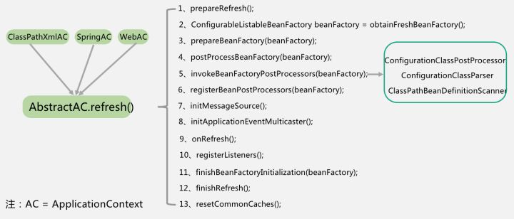

# BeanFactory

> 2020/4/23

先看源码中的注释，最好结合英文看

```
用于访问Spring bean容器的根接口。这是bean容器的基本客户端视图;其他接口如{@link ListableBeanFactory}和({@link org.springframework.bean .factory.config. configurablebeanfactory})可用于特定目的。

这个接口是由包含许多bean定义的对象实现的，每个bean定义都由一个字符串名惟一标识。根据bean定义，工厂将返回所包含对象的独立实例(原型设计模式)，或单个共享实例(与单例设计模式相比的更好的选择，在单例设计模式中，实例是工厂范围内的单例)。返回哪种类型的实例取决于bean工厂配置:API是相同的。从Spring 2.0开始，根据具体的应用程序上下文(例如，“请求”和“会话”在web环境中适用)。

这种方式的关键点是BeanFactory是应用程序组件的中心注册表，并集中应用程序组件的配置(例如，单个对象不再需要读取属性文件)。请参阅“专家一对一的J2EE设计和开发”的第4章和第11章，以了解这种方法的好处。

请注意，通常更好的方法是依靠依赖项注入(“推”配置)通过setter或构造函数来配置应用程序对象，而不是使用任何形式的“拉”配置(如BeanFactory查找)。Spring的依赖注入功能是使用这个BeanFactory接口及其子接口实现的。

通常，BeanFactory将加载存储在配置源(如XML文档)中的bean定义，并使用({@code org.springframework.beans})包来配置bean。但是，实现可以简单地返回它在必要时直接在Java代码中创建的Java对象。对于如何存储这些定义没有限制:LDAP、RDBMS、XML、属性文件等。鼓励实现支持bean之间的引用(依赖项注入)。

与{@link ListableBeanFactory}中的方法不同，此接口中的所有操作也将检查父工厂是否为{@link HierarchicalBeanFactory}。如果在这个工厂实例中没有找到bean，则会询问直接的父工厂。工厂实例中的bean应该覆盖任何父工厂中同名的bean。

BeanFactory实现应该尽可能支持标准的bean生命周期接口。初始化方法的全套及其标准顺序为:

1. BeanNameAware的{@code setBeanName}

2. BeanClassLoaderAware的{@code setBeanClassLoader}

3. BeanFactoryAware的{@code setBeanFactory}

4. EnvironmentAware的{@code setEnvironment}

5. EmbeddedValueResolverAware的{@code setEmbeddedValueResolver}

6. ResourceLoaderAware的{@code setResourceLoader}
(仅适用于在应用程序上下文中运行时)

7. ApplicationEventPublisherAware的{@code setApplicationEventPublisher
(仅适用于在应用程序上下文中运行时)

8. MessageSourceAware的{@code setMessageSource}
(仅适用于在应用程序上下文中运行时)

9. ApplicationContextAware的{@code setApplicationContext}
(仅适用于在应用程序上下文中运行时)

10. ServletContextAware的{@code setServletContext}
(仅适用于在web应用程序上下文中运行时)

11. beanpostprocessor的方法

12. InitializingBean的{@code afterPropertiesSet}

13. 一个自制的init-method定义

14. {@code后处理后初始化}beanpostprocessor的方法
```

再用大白话说一下：

`BeanFactory` 是一个接口，**提供了 `IOC` 容器最基本的形式，给具体的 `IOC` 容器实现提供了规范**。在 `Spring` 中，`BeanFactory` 是 `IOC` 容器的核心接口，它的职责包括**实例化、定位、配置应用程序中的对象及建立这些对象间的依赖**(依赖注入)。`BeanFactory` 只是个接口，并不是 `IOC` 容器的具体实现，但是 `Spring` 容器给出了很多种实现，如 `DefaultListableBeanFactory`、`XmlBeanFactory`、`ApplicationContext` 等， 都是附加了某种功能的实现。

`BeanFactory` 和 `ApplicationContext`（继承了 `BeanFactory`）就是 `Spring` 框架的两个 `IOC` 容器，现在一般使用 `ApplicationnContext`，其不但包含了 `BeanFactory` 的作用，同时还进行更多的扩展。 （也有种说法是 `BeanFactory` 是低级容器，`ApplicationContext` 是高级容器。）

其实就是用来生产和管理 `Bean` 的。通过 `BeanDefinitionRegistry` 将 `Bean` 注册到 `BeanFactzaiory` 中。

`BeanFactory` 初始化流程：



主要来看看 `refresh` 方法，该方法定义在 `ConfigurableApplicationContext` 接口中，下面是`AbstractApplicationContext` 抽象类中的一个实现

```java
@Override
	public void refresh() throws BeansException, IllegalStateException {
		synchronized (this.startupShutdownMonitor) {
			// Prepare this context for refreshing. 为刷新准备此上下文。
			prepareRefresh();

			// Tell the subclass to refresh the internal bean factory.告诉子类刷新内部bean工厂。
			ConfigurableListableBeanFactory beanFactory = obtainFreshBeanFactory();

			// Prepare the bean factory for use in this context. 准备bean工厂以供在此上下文中使用。
			prepareBeanFactory(beanFactory);

			try {
				// Allows post-processing of the bean factory in context subclasses. 允许在上下文子类中对bean工厂进行后处理。
				postProcessBeanFactory(beanFactory);

				// Invoke factory processors registered as beans in the context. 调用上下文中注册为bean的工厂处理器。
				invokeBeanFactoryPostProcessors(beanFactory);

				// Register bean processors that intercept bean creation. 注册拦截bean创建的bean处理器。
				registerBeanPostProcessors(beanFactory);

				// Initialize message source for this context. 为此上下文初始化消息源。
				initMessageSource();
 
				// Initialize event multicaster for this context. 为此上下文初始化事件多播程序。
				initApplicationEventMulticaster();

				// Initialize other special beans in specific context subclasses. 初始化特定上下文子类中的其他特殊bean。
				onRefresh();

				// Check for listener beans and register them. 检查侦听器bean并注册它们。
				registerListeners();

				// Instantiate all remaining (non-lazy-init) singletons. 实例化所有剩余的(非惰性初始化)单例。
				finishBeanFactoryInitialization(beanFactory);

				// Last step: publish corresponding event. 最后一步:发布相应的事件。
				finishRefresh();
			}

			catch (BeansException ex) {
				if (logger.isWarnEnabled()) {
					logger.warn("Exception encountered during context initialization - " +
							"cancelling refresh attempt: " + ex);
				}

				// Destroy already created singletons to avoid dangling resources. 销毁已经创建的单例，以避免挂起资源。
				destroyBeans();

				// Reset 'active' flag.
				cancelRefresh(ex);

				// Propagate exception to caller.
				throw ex;
			}

			finally {
				// Reset common introspection caches in Spring's core, since we
				// might not ever need metadata for singleton beans anymore...
                //重置Spring核心中的公共自省缓存，因为我们可能再也不需要单例bean的元数据了……
				resetCommonCaches();
			}
		}
	}
```

**`refresh` 方法中，操作共分13步：**

第1步：对刷新进行准备，包括设置开始时间、设置激活状态、初始化 `context` 环境中的占位符，这个动作根据子类的需求由子类来执行，然后验证是否缺失必要的 `properties`；

第2步：刷新并获得内部的 `bean factory`；

第3步：对 `bean factory` 进行准备工作，比如设置类加载器和后置处理器、配置不进行自动装配的类型、注册默认的环境 `bean`；

第4步：为 `context` 的子类提供后置处理 `bean factory` 的扩展能力。如果子类想在 `bean` 定义加载完成后，开始初始化上下文之前做一些特殊逻辑，可以复写这个方法；

第5步，执行 `context` 中注册的 `bean factory` 后缀处理器；

注：这里有两种后置处理器，一种是可以注册 `bean` 的后缀处理器，另一种是针对 `bean factory` 进行处理的后置处理器。执行的顺序是，先按优先级执行可注册 `bean` 的处理器，在按优先级执行针对 `beanfactory` 的处理器。

对 `SpringBoot` 来说，这一步会进行注解 `bean definition` 的解析。流程如右面小框中所示，由`ConfigurationClassPostProcessor` 触发、由 `ClassPathBeanDefinitionScanner` 解析并注册到 `bean factory`。

第6步：按优先级顺序在 `beanfactory` 中注册 `bean` 的后缀处理器，`bean` 后置处理器可以在 `bean` 初始化前、后执行处理；

第7步：初始化消息源，消息源用来支持消息的国际化；

第8步：初始化应用事件广播器。事件广播器用来向 `applicationListener` 通知各种应用产生的事件，是一个标准的观察者模式；

第9步，是留给子类的扩展步骤，用来让特定的 `context` 子类初始化其他的 `bean`；

第10步，把实现了 `ApplicationListener` 的 `bean` 注册到事件广播器，并对广播器中的早期未广播事件进行通知；

第11步，冻结所有 `bean` 描述信息的修改，实例化非延迟加载的单例 `bean`；

第12步，完成上下文的刷新工作，调用 `LifecycleProcessor` 的 `onFresh()` 方法以及发布`ContextRefreshedEvent` 事件；

第13步：在 `finally` 中，执行第十三步，重置公共的缓存，比如 `ReflectionUtils` 中的缓存、`AnnotationUtils` 中的缓存等等；


