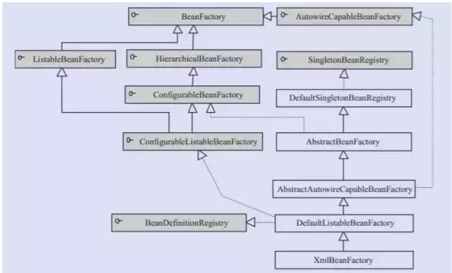
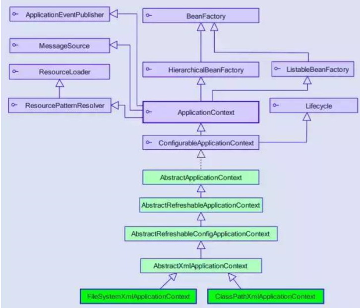

# BeanFactory基础设施

> 时间：2020/8/10

BeanFactory 是 Spring 框架的基础设施，面向 Spring 本身；ApplicationContext 面向使用 Spring 框架的开发者，几乎所有的应用场合我们都直接使用 ApplicationContext 而非底层的 BeanFactory。

下面列举一些基础设施：

1. *BeanDefinitionRegistry 注册表*

   Spring 配置文件中的每一个节点元素在 Spring 容器里通过一个 BeanDefinition 对象表示，他描述了 Bean 的配置信息。而 BeanDefinitionRegistry 接口提供了**向容器手工注册** BeanDefinition

   对象的方法。

2. *BeanFactory 顶层接口*

   位于类结构树的顶端，它最主要的方法就是 getBean(String beanName)，该方法从容器返回特定名称的 Bean，**BeanFactory 的功能通过其他的接口得到不断扩展。**

3. *ListableBeanFactory*

   该接口定义了访问容器中的 Bean 基本信息的若干方法，如查看 Bean 的个数、获取某一类型 Bean 的配置名、查看容器中是否包括某一 Bean 等方法。

4. *HierarchicalBeanFactory 父子级联*

   父子级联 IOC 容器的接口，子容器可以通过接口方法访问父容器；通过 HierarchicalBeanFactory 接口，Spring 的 IOC 容器可以建立父子层级关联的容器体系，子容器可以访问父容器中的 Bean，但父容器不能访问子容器的 Bean。Spring 使用父子容器实现了很多功能，比如在 Spring MVC 中，展现在 Bean 位于一个子容器中，而业务层和持久层的 Bean 位于父容器中。这样，展现层的 Bean 就可以引用业务层和持久层的 Bean，而业务层和持久层的 Bean 则看不到展现层的 Bean。

5. *ConfigurableBeanFactory*

   增强了 IOC 容器的**可定制性**，定义了设置类装载器、属性编辑器、容器初始化后置处理器等方法；

6. *AutowireCapableBeanFactory 自动装配*

   定义了将容器中的 Bean 按某种规则（如名字匹配、按类型匹配等）进行自动装配的方法。

7. *SignletonBeanRegistry 运行期间注册单例 Bean*

   定义了允许在运行期间像容器注册单实例 Bean 的方法，对于单实例（singleton）的 Bean 来说，**BeanFactory 会缓存 Bean 实例，所以第二次使用 getBean() 获取 Bean 时将直接从 IOC 容器的缓存中获取 Bean实例**。Spring 在 DefaultSingletonBeanRegistry 类中提供了一个用于缓存单实例 Bean 的缓存器，他是一个用 HashMap 实现的缓存器，单实例的 Bean 以 beanName 为键保存在这个 HashMap 中。

8. 依赖日志框架

   在初始化 BeanFactory 时，必须为其提供一种日志框架，比如使用 Log4J，即在类路径下提供 Log4J 配置文件，这样启动 Spring 容器才不会报错。

## 不得不提的 ApplicationContext(面向开发应用)

ApplicationContext 由 BeanFactory 派生而来，提供了更多面向实际应用的功能。ApplicationContext 继承了HierarchicalBeanFactory 和 ListableBeanFactory 接口，在此基础上，还通过多个其他的接口扩展了 BeanFactory 的功能。

1. ClassPathXmlApplicationContext: 默认从类路径加载配置文件
2. FileSystemXmlApplicationContext: 默认从文件系统中装在配置文件
3. ApplicationEventPublisher:让容器拥有发布应用上下文事件的功能，包括容器启动、关闭事件。
4. MessageSource:为应用提供 i18n 国际化消息访问的功能
5. ResourcePatternResolver:所有 ApplicationContext 实现类都实现类似于 PathMatchingResourcePatternResolver 的功能，可以通过带前缀的 Ant 风格的资源文件装载 Spring 的配置文件

6. LifeCycle:该接口是 Spring 2.0 加入的，该接口提供了 start() 和 stop() 两个方法，主要用于异步处理过程，在具体使用时，该接口同时被 ApplicationContext 实现及具体 Bean 实现，ApplicationContext 会将 stop/start 的信息传递给容器中所有实现了该接口的 Bean，以达到管理和控制 JMX、任务调度等目的。
7. ConfigurableApplicationContext 扩展于 ApplicationContext，他新增加了两个主要的方法：refresh() 和 close()，让 ApplicationContext 具有启动、刷新和关闭应用上下文的能力。在应用上下文关闭的情况下使用 refresh() 即可启动应用上下文，在已经启动的状态下，调用 refresh() 则清除缓存并重新装载配置信息，而调用 close() 则可关闭应用上下文。
