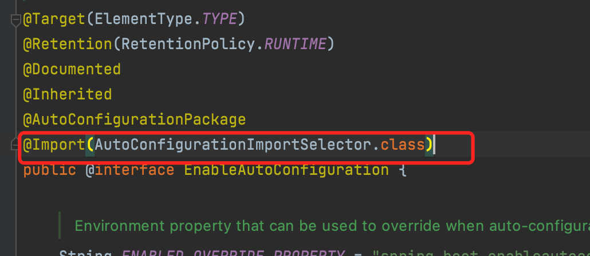
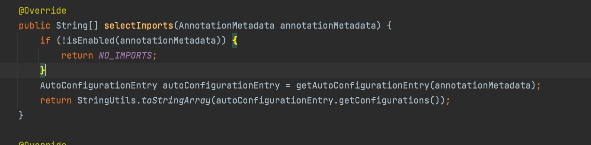
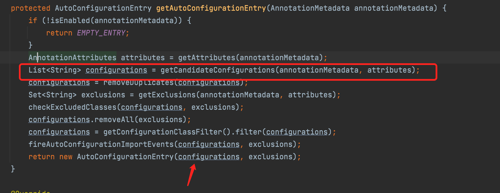

# Spring Boot自动配置基本原理

首先@EnableAutoConfiguration注解是一个关键点，可以点进去看一看

有一个非常重要的@Import，这种方式是上一篇文章中@Import使用的第二种方式，看看AutoConfigurationImportSelector关键的代码。

说白了也就是通过spring.factories类似SPI的机制，将可能不在包扫描路径下的Bean加入到容器中并生效，loadFactoryNames相关详情可见第一篇文章。

