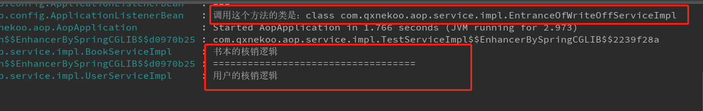

# Spring 中的 ApplicationListener

> 时间：2020/4/18

写代码时遇到这样一个业务场景。

核销的时候，有多种核销，比如返利核销、预付款核销等等，要根据不同的类型进行各自的核销逻辑，模拟代码如下：

```java
//核销入口 EntranceOfWriteOffServiceImpl 实现了AppContextInitLisenter接口
@Service
public class EntranceOfWriteOffServiceImpl implements EntranceOfWriteOffService, AppContextInitLisenter {
    private static final Logger log = LoggerFactory.getLogger(EntranceOfWriteOffServiceImpl.class);
    private Map<String, CommonService> typeMap = new HashMap<>();

    @Override
    //实现AppContextInitLisenter接口中的方法
    public void contextInitialized(ApplicationContext applicationContext) {
        Map<String, CommonService> map = applicationContext.getBeansOfType(CommonService.class);
        map.forEach((k, v) -> typeMap.put(v.getType(), v));
    }


    @Override
    //核销入口方法
    public void writeOff(String type) {
        //..
        CommonService comm = typeMap.get(type);
        comm.process();
        //..
    }
}

//CommonService 各种核销类型去实现这个接口来写自己的核销逻辑
public interface CommonService {
    //核销逻辑
    void process();
    //获取核销类型
    String getType();
}

//AppContextInitLisenter
public interface AppContextInitLisenter {
    void contextInitialized(ApplicationContext applicationContext);
}
```

代码其实不难理解：`contextInitialized` 方法利用 `Spring` 容器将实现 `CommonService` 接口的 `Bean` 收集起来，具体核销的时候从这个 `typeMap` 里取出自己的核销实现对象来调用核销逻辑。

我比较费解的是 `contextInitialized` 什么时候调用的，类里面没有显示调用的地方，定义这个方法的接口 `AppContextInitLisenter` 也只是一个普通的接口，也没有去继承 `Spring` 中的某个接口或者使用到了什么注解，只是从名字上来看像是初始化 `Spring` 容器的监听，但仅仅是名字像这个理由是不能让我满足的。

于是找啊找，终于在 `applicationContext.xml` 中找到了一个 `Bean`，这边就不用项目中的代码了，模拟一下：

```java
@Configuration
public class ApplicationListenerBean implements ApplicationListener {
    @Override
    public void onApplicationEvent(ApplicationEvent applicationEvent) {
        if (applicationEvent instanceof ContextRefreshedEvent) {
            ApplicationContext applicationContext = ((ContextRefreshedEvent) applicationEvent).getApplicationContext();
            Map<String, AppContextInitLisenter> beanMap = applicationContext.getBeansOfType(AppContextInitLisenter.class);
            beanMap.forEach((k, v) -> v.contextInitialized(applicationContext));
        }
    }
}
```

再点进去这个 `ApplicationListener` 接口：

```java
//
// Source code recreated from a .class file by IntelliJ IDEA
// (powered by Fernflower decompiler)
//

package org.springframework.context;

import java.util.EventListener;

@FunctionalInterface
public interface ApplicationListener<E extends ApplicationEvent> extends EventListener {
    void onApplicationEvent(E var1);
}
```

这就舒服了，这是 `Spring` 中提供的一个函数式接口，这样一切就说的通了，`ApplicationListenerBean` 这里面的代码也大概看得懂：

> 将实现 `AppContextInitLisenter` 接口的 `Bean` 收集起来，然后逐个去调用实现的方法 `contextInitialized()`，这个方法就是在这边调用的。

之后做了个简单的模拟。

创建具体核销实现类：`BookServiceImpl` 和 `UserServiceImpl`，就叫核销书本和核销用户吧~，不要问我是什么鬼，只是单纯的模拟而已。

```java
//用户核销
@Service
public class UserServiceImpl implements UserService , CommonService {
    private Logger logger = LoggerFactory.getLogger(this.getClass());

    private static final String type = "USER";
    @Override
    public void process() {
       logger.info("用户的核销逻辑");
        //...
    }

    @Override
    public String getType() {
        return type;
    }
}
//书本核销
@Service
public class BookServiceImpl implements BookService , CommonService {
    private Logger logger = LoggerFactory.getLogger(this.getClass());
    private static final  String type = "BOOK";
    @Override
    public void process() {
        logger.info("书本的核销逻辑");
        //...
    }

    @Override
    public String getType() {
        return type;
    }
}


//为了显示更加明显 ApplicationListenerBean类加入一点日志打印
@Configuration
public class ApplicationListenerBean implements ApplicationListener {
    private Logger log = LoggerFactory.getLogger(ApplicationListenerBean.class);
    @Override
    public void onApplicationEvent(ApplicationEvent applicationEvent) {
        if (applicationEvent instanceof ContextRefreshedEvent) {
            ApplicationContext applicationContext = ((ContextRefreshedEvent) applicationEvent).getApplicationContext();
            Map<String, AppContextInitLisenter> beanMap = applicationContext.getBeansOfType(AppContextInitLisenter.class);
            beanMap.forEach((k, v) -> {
                log.info("===");
                log.info("调用这个方法的类是：{}",v.getClass());
                v.contextInitialized(applicationContext);
            });
        }
    }
}
```

最后在启动类中调用核销入口方法，

```java
entranceOfWriteOffService.writeOff("BOOK");
logger.info("===================================");
entranceOfWriteOffService.writeOff("USER");
```

运行结果如下，可以看到，实际上调用这个方法的对象还是核销入口对象。




总结：

> 其实使用 `if else` 一样可以达到这种效果，不同的类型调用不同的逻辑，但是明显这种方式更加优雅，扩展性也更强。
>
> 这边只是简单记录一下代码的实现，原理来说的话从代码大概猜的出来是什么事件的监听之类的，下一篇会详细介绍里面的 `Spring` 原理。


