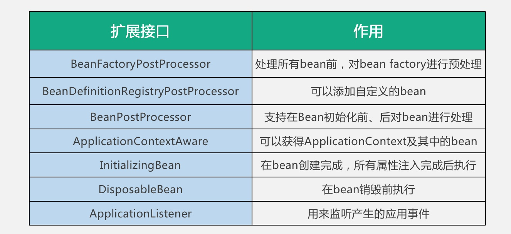

# Spring中的扩展

扩展接口：

- `BeanFactoryPostProcessor`

  `BeanFactory` 后置处理器，支持在 `BeanFactory` 标准初始化完成后，对 `BeanFactory` 进行一些额外处理。这时所有的 `bean` 的描述信息已经加载完毕，但是还没有进行 `bean` 初始化。例如  `PropertyPlaceholderConfigurer`,就是在这个扩展点上对bean属性中的占位符进行替换。

- `BeanDefinitionRegistryPostProcessor`

  它扩展自 `BeanFactoryPostProcessor`，在执行 `BeanFactoryPostProcessor` 的功能前，提供了可以添加 `beanDefinition` 的能力，允许在初始化一般 `bean` 前，注册额外的 `bean`。例如可以在这里根据 `bean` 的 `scope` 创建一个新的代理 `bean`。

- `BeanPostProcessor`

  提供了在 `bean` 初始化之前和之后插入自定义逻辑的能力。与 `BeanFactoryPostProcessor` 的区别是处理的对象不同，`BeanFactoryPostProcessor` 是对 `beanFactory` 进行处理，`BeanPostProcessor` 是对 `bean` 进行处理。

这些都是可以通过实现 `Ordered` 和 `PriorityOrdered` 接口来指定执行顺序。实现 `PriorityOrdered` 接口的 `processor` 会先于实现 `Ordered` 接口的执行。

- `ApplicationContextAware`

  可以获取 `ApplicationContext` 及其中的 `bean`，当需要在代码中动态获取 `bean` 时，可以通过实现这个接口来实现。

- `InitializingBean`

  可以在 `bean` 初始化完成，所有属性设置完成后执行特定逻辑，例如对自动装配对属性进行验证等等。

- `DisposableBean`

  用于 `bean` 被销毁前执行特定的逻辑，例如做一些回收工作等。

- `ApplicationListener`

  用来监听 `Spring` 的标准应用事件或者自定义事件。

